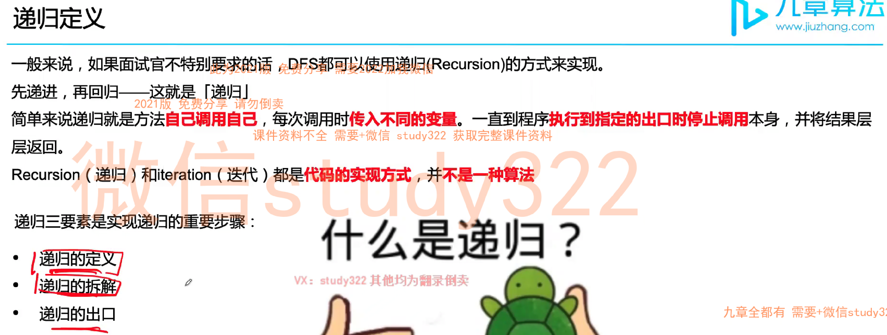
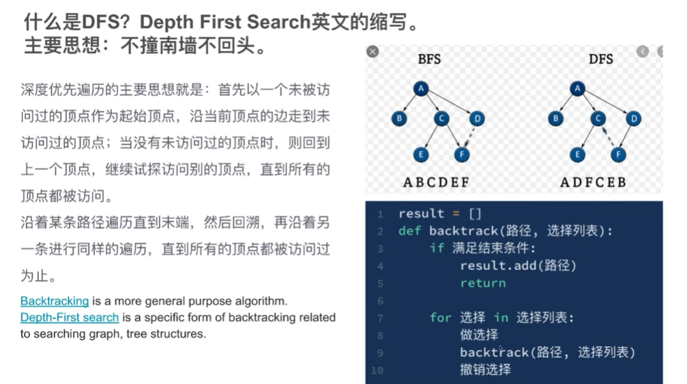

# Backtracking Notes

## prep - Recursion



- 信息是自上而下传递，属于遍历法，需要一个全局变量，或者share 一个变量
- 和分治法不一样，分治法一般通过return来调整结果，不用share 变量
- 一般求所有具体方案 （子集，permutation，combination, subsets...)

## combination

- 无关顺序，[1,2] and [2,1] are the same combination
- 有多少种组合：e.g [1,2,3], 组合共有2^3, 及2^n种组合  


##  Template:


```java
public void backtrack(Candidate candidate) {
        if (findSolution(candidate)) {
            output(candidate);
            return;
        }

        // Iterate all possible candidates.
        for (Candidate nextCandidate : listOfCandidates()) {
            if (isValid(nextCandidate)) {
                // Try this partial candidate solution.
                place(nextCandidate);
                // Given the candidate, explore further.
                backtrack(nextCandidate);
                // Backtrack.
                remove(nextCandidate);
            }
        }
```