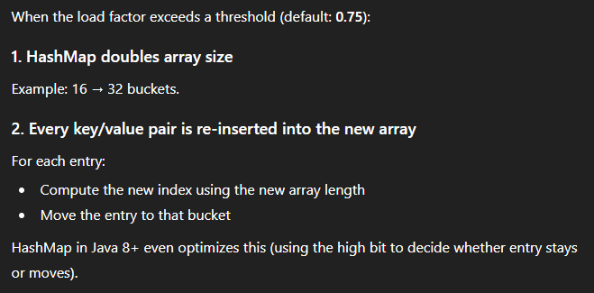

# HashMap

A HashMap stores entries in an array of buckets. It takes the key’s hashCode, mixes it with a small hash function, then uses bitwise AND to find the bucket. Collisions are handled with linked lists, but if a bucket becomes too long, it turns into a red-black tree to avoid O(n) lookups. When the size exceeds 75% of the capacity, the table grows and redistributes entries. Average time for get/put is O(1). Worst case is O(n) or O(log n) with trees.

## How to implement hashmap?

1. High-Level Overview

    The easiest way to describe it is: it’s basically an array of buckets, and each bucket can store either a single entry, a linked list of entries, or a red-black tree if collisions get too heavy.

2. How Keys Are Mapped to Buckets?

    When put(key, value) is called, a hash for the key is computed. It actually doesn’t use the raw hashCode() directly. There’s a small hash spreading function that mixes the high bits into the low bits: h ^ (h >>> 16)

    The goal is to avoid case where only the low bits vary, because the array size is always a power of two. After that, the bucket index is computed by: index = hash & (table.length - 1), So bucket selection is just a cheap bitwise AND, not a modulo.

3. Collision Handling

    If two different keys land on the same bucket, the HashMap uses separate chaining. In Java 8 and later, chaining works in two modes:

    - Linked list – default
    - Red-black tree – when the chain gets too long

    When the number of entries in a single bucket exceeds 8 and the table is reasonably large (size ≥ 64), Java converts the linked list into a red-black tree. The idea is simple: avoid the worst-case O(n) lookup from a long list, and guarantee O(log n). But under normal distribution, we’re still close to O(1) average time.

4. Put Logic (What Actually Happens)

When inserting a value:
- Compute hash
- Find bucket index
- If bucket is empty → place the node
- If bucket is not empty → compare keys
    - If same key → overwrite value
    - If different key → add to the chain
- If chain becomes too long → treeify
- If size exceeds load factor threshold → resize

5. Load Factor & Resizing

A HashMap automatically resizes when the number of entries exceeds:

capacity × loadFactor

Default load factor is 0.75, which balances memory usage and collision probability. When resizing happens, the capacity doubles.

Java 8 optimizes rehashing during resize: each node either stays in the same bucket or moves to bucket + oldCapacity. So not every node needs a full rehash; it’s a small optimization.

6. Time Complexity

- Average get/put: O(1)
- Worst case:
    - Linked list: O(n)
    - Red-black tree: O(log n)

But the worst case is extremely rare because hashing distributes keys pretty evenly.

## Commonly Asked Follow-ups
This is much faster than modulo and ensures keys are distributed more evenly across buckets.

---

## ❓ 2. Why does Java convert the bucket from a linked list to a red-black tree?
**Answer:**  
Treeification avoids worst-case performance.  
If too many keys collide into the same bucket, a linked list becomes O(n).  
A red-black tree guarantees O(log n) lookup time even when many collisions happen.

---

## ❓ 3. What happens during resizing?
**Answer:**  
When the size exceeds `capacity × loadFactor`, HashMap doubles its capacity and re-distributes all existing entries.  
In Java 8, rehashing is optimized — each entry either stays in its bucket or moves to `bucket + oldCapacity`, so HashMap doesn’t recompute the full hash for every key.

---

## ❓ 4. Why is the default load factor 0.75?
**Answer:**  
0.75 is a practical balance between memory cost and collision probability.  
A lower load factor wastes memory; a higher load factor increases the chance of long chains.  
0.75 minimizes collisions without using too much space.

---

## ❓ 5. Is HashMap thread-safe? Why not?
**Answer:**  
No, HashMap is not thread-safe.  
Concurrent modifications can cause inconsistent state, lost updates, or structural corruption.  
For multi-threaded environments, we typically use `ConcurrentHashMap`, which uses fine-grained synchronization and lock-free techniques.

---

## ❓ 6. What if two different keys have the same hashCode?
**Answer:**  
This is normal.  
HashMap first compares hash values, and if they match, it compares keys using `equals()`.  
Only if both hash and `equals()` match are the keys considered the same.

---

## ❓ 7. What is the worst-case time complexity of get()?
**Answer:**  
- **Linked list:** O(n)  
- **Red-black tree:** O(log n)  
But on average, because of good hash distribution and treeification, lookups remain O(1).

---

## ❓ 8. Why do keys need both `hashCode()` and `equals()`?
**Answer:**  
Because HashMap uses:
1. `hashCode()` to find the bucket  
2. `equals()` to distinguish keys inside that bucket  

If two keys are logically equal but have different hash codes, the HashMap will treat them as separate keys, which breaks correctness.

---

## ❓ 9. Why does HashMap allow null keys but Hashtable does not?
**Answer:**  
HashMap was designed for flexibility and allows one null key.  
Hashtable comes from older Java versions where null was disallowed for safety and synchronization reasons.  
This difference was maintained for backward compatibility.

---

## ❓ 10. How does HashMap handle hash collisions in Java 8?
**Answer:**  
HashMap uses **separate chaining**:  
- Collisions first form a linked list  
- If the list grows beyond 8 elements and capacity ≥ 64, it converts the list into a red-black tree  
This prevents performance degradation from O(n) to O(log n).

