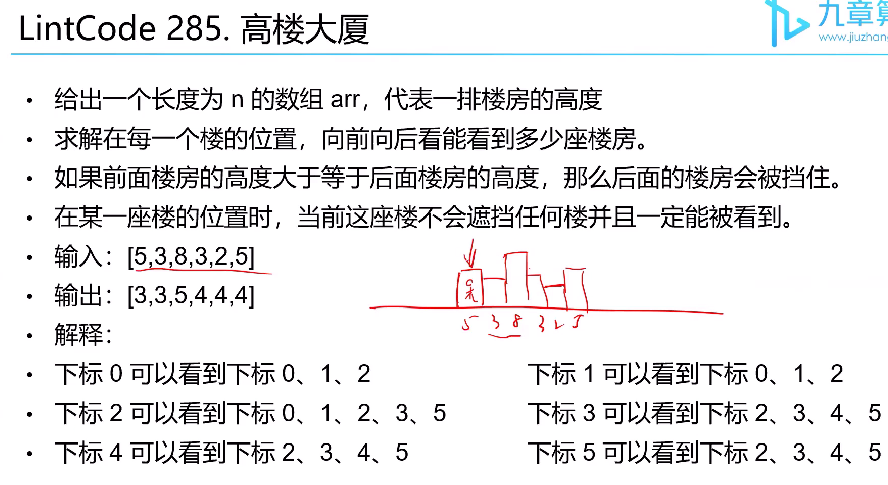

# Monotonic Stack

## 算法介绍

单调栈是一种借助栈实现的算法，特征是栈内元素按某种规则（一般是数字大小）单调递增或者递减

最常见用法：对于数组中某个元素，在数组种找到它左侧（或右侧）离它最近的一个比他大或者比他小的数字

例子 [4,5,6,3,5,4,7,2]
- 数字入栈前要判断单调性是否存在，存在就按照某种规则入栈
- 当单调性不存在或则被打破,则一直弹出栈直到回复单调性，同时对弹出的数字做某处计算或者处理

单调栈模板

```java
for i from 0 to (n-1)
    
    // 不断弹栈直到单调性恢复
    while 栈不空 and 单调性不存在
        记录此时的答案（处理/计算）
        stack.pop()
    
    // 这里压入的是index不是nums[index], 可以通过下标找到value
    stack.push(i)
```

时间复杂度O(N) 每个元素入栈出栈各一次

## 例题

### Q1 高楼大厦


解法单调栈

- 分别站在某个位置上向左 or 向右能看见多少楼房，
- 从头到尾，从尾到投进行两次扫描，
- 入栈前的栈的大小就是能看见的房子的数量

```java
public static int[] tallBuilding(int[] arr) {
        int n = arr.length;
        int[] res = new int[n];
        Arrays.fill(res, 1);

        // 左边能看到多少楼
        countBuildings(arr, res, 0, n, 1);
        // 右边能看到多少楼
        countBuildings(arr, res, n-1, -1, -1);

        return res;
    }

    public static void countBuildings(int[] arr, int[] res, int start, int end, int delta) {
        Deque<Integer> stack = new ArrayDeque<>();

        for (int i = start; i != end; i += delta) {
            res[i] += stack.size();

            while (!stack.isEmpty() && arr[i] >= arr[stack.peek()]) {
                stack.pop();
            }

            stack.push(i);
        }
    }
```