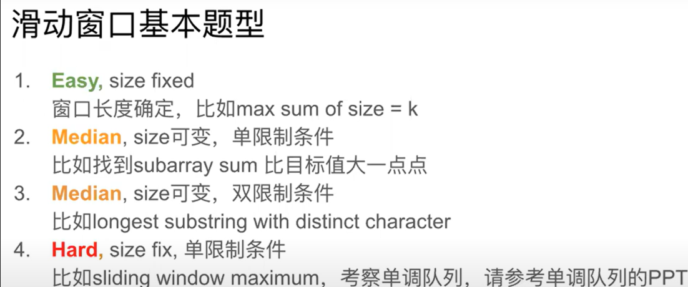
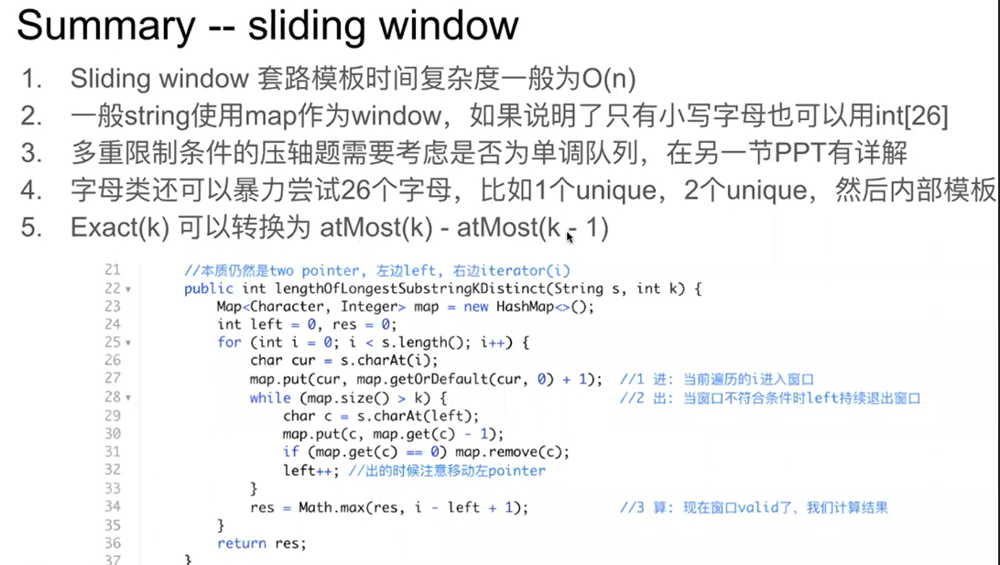

# Sliding Window

- 字串一般需要用到sliding window
- 什么时候应该移动 right 扩大窗口？窗口加入字符时，应该更新哪些数据？
- 什么时候窗口应该暂停扩大，开始移动 left 缩小窗口？从窗口移出字符时，应该更新哪些数据？
- 我们要的结果应该在扩大窗口时还是缩小窗口时进行更新？
- 窗口为左闭右开 [left, right)；left & left之间为窗口
- Time complexity： 一般为O(n)，每个ele 只会进入窗口一次

