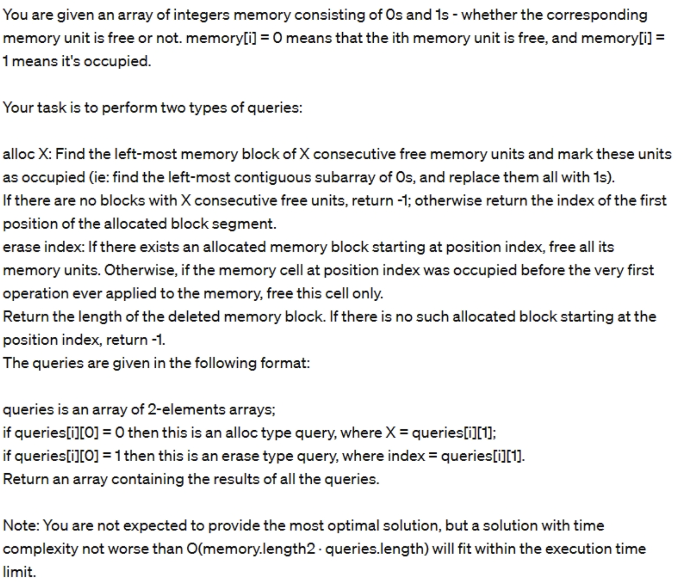
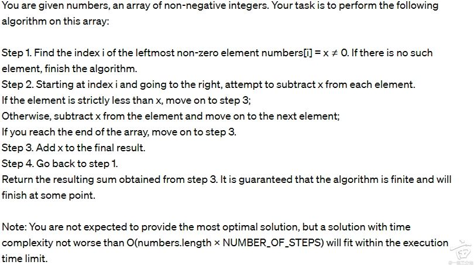
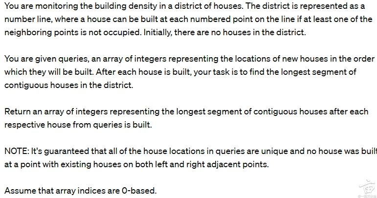
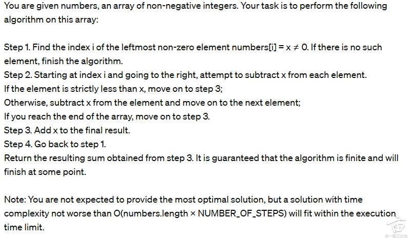

1. 給定一個 array of integer，計算共有多少個 integer 裡面出現 0 的次數是 odd。
e.g. nums = [10, 4, 102, 53, 700], return 2

```java
public static int countNumbersWithOddZeros(int[] nums) {
        int res = 0;

        for (int num: nums) {
            int zeroCount = countZeros(num);
            if (zeroCount % 2 == 0) res++;
        }
        return res;
    }

    public static int countZeros(int num) {
        num = Math.abs(num);
        if (num == 0) return 1;

        int count = 0;
        while (num > 0) {
            if (num % 10 == 0) count++;
            num = num / 10;
        }
        
        return count;
    }
```

2. 给一个数组和整数（distance），找数组里数值最接近的两个数，这两个数的距离要不小于distance。好像是利口原题，记不清了

```java
// 解法一： O(n^2)
  public static int[] findMostClose(int[]nums, int distance) {
        int n = nums.length;
        int minDiff = Integer.MAX_VALUE;
        int[] res = new int[2];

        for (int i = 0; i < n; i++) {
            for (int j = i + distance; j < n; j++) {
                int diff = Math.abs(nums[i] - nums[j]);
                if (diff < minDiff) {
                    res[0] = i;
                    res[1] = j;
                    minDiff = diff;
                }

            }
        }
        return res;
    }

// 解法二： O(nlogn)
public static int[] closestPairWithDistance(int[] nums, int distance) {
    int n = nums.length;
    int minDiff = Integer.MAX_VALUE;
    int[] result = new int[2];
    TreeSet<int[]> set = new TreeSet<>((a, b) -> a[0] == b[0] ? a[1] - b[1] : a[0] - b[0]);
    // 存 [value, index]

    for (int i = 0; i < n; i++) {
        // 符合条件的元素才能进入 set
        if (i - distance >= 0) {
            set.add(new int[]{nums[i - distance], i - distance});
        }

        // 在 set 里找最接近 nums[i] 的值
        int[] key = new int[]{nums[i], i};
        int[] floor = set.floor(key);
        int[] ceil = set.ceiling(key);

        if (floor != null) {
            int diff = Math.abs(nums[i] - floor[0]);
            if (diff < minDiff) {
                minDiff = diff;
                result[0] = floor[1];
                result[1] = i;
            }
        }
        if (ceil != null) {
            int diff = Math.abs(nums[i] - ceil[0]);
            if (diff < minDiff) {
                minDiff = diff;
                result[0] = ceil[1];
                result[1] = i;
            }
        }
    }

    return result;
}
```

3.  given an integer array nums and a number k, check if each number in the nums array is a power of k, return the total number of integer numbers in the nums array that are power of k.
Example:
input: nums = [1,3,5,8,16], k=2
output: 3. Because 1, 8 and 16 are power of 2. 

```java
public static int powerOfK(int[] nums, int k) {
    int count = 0;
    for (int num : nums) {
        if (isPowerOfK(num, k)) {
            count++;
        }
    }
    return count;
}

public static boolean isPowerOfK(int num, int k) {
    if (num < 1) return false;
    if (k == 1) return num == 1; // 只有 1 是 1 的幂

    while (num % k == 0) {
        num /= k;
    }
    return num == 1;
}

···

4. 第一题，简单题，给一个数组，找到相邻两个数一个为奇数，一个位偶数的位置，然后返回index，否则返回-1
例如【1，1，6】，返回2，因为相邻的两个数【1，6】满足条件【1，1，1】，返回-1 (第一题返回的是第一组后一个element的index)

```java

```

5. English:
Given a list of integers, find the sum of elements that are greater than their adjacent elements. For the first and last elements, only compare with their single adjacent element.

中文:
给定一个整数列表，找到大于其相邻元素的元素之和。对于第一个和最后一个元素，只与它们唯一的相邻元素比较。

Examples / 示例
Example 1 / 示例1

Input: [1, 3, 2, 4, 1]
Output: 7
Explanation:
- Index 0: 1 < 3, not a peak
- Index 1: 3 > 1 and 3 > 2, peak (add 3)
- Index 2: 2 < 3 and 2 < 4, not a peak
- Index 3: 4 > 2 and 4 > 1, peak (add 4)
- Index 4: 1 < 4, not a peak
Sum = 3 + 4 = 7


5. 第三题是给一个paragraphs = [["hello, word"], ["ni", "hao","aabbssss"]]和width，让你return一个formatted array。每一行都要在规定width之内，首尾额外加两行星号，以及每一行开头和结尾也要加星号，星号不算在width里，然后衔接paragraph里的word需要加space，space算在width里，如果这一行不够width，在这一行的左右加空格。比如说width =11，你要return的结果大概是
[
"**************",
"*hello world*",
"*     ni hao   *",
"*  aabbssss  *",
"**************"
]

26. 第三题比较长 但是也没有复杂度的要求
输入solution（arr<arr<string>>  paragraphs，arr<string> alignment, int width)）
输出是一篇文章arr<string>，每一行放在arr里输出, 每个词之间空格，一行最长<=width
比如paragraphs={{hello, world, is, ok}, {longest, paragraphs}} align={LEFT, RIGHT}, weith = 14
输出
***************(16个*)
*helle world is*
*ok                 *
*         longest*
*   paragraphs*
****************


6. 好像是leetcode原题。一个lamps array，每一个lamp照射的范围是lamp[0]-lamp[1] 到lamp[0] + lamp[1]. 求被照射的最多的点，如果照射的点次数相同，return坐标最小的。我没做出最优


2. 给一个array和一个replacement rate，array里只有'A’和'P'，例如【'A’，'A’，'A’，'P'，'P'，'P'】，让根据以下规则改变array，返回需要多少轮能到最终状态
如果array末尾的'P'数量大于或者等于replacement rate，去除末尾的‘P‘，去除数量为replacement rate
如果array里有'A’，把最后一个'A’换成'P’
否则，到达最终状态

2. 這題比較麻煩。給定一個 array ["A", "A", "A"..."P", "P"...]，只會有 A 和 P，然後 A 都會出現在 P 前面。另外還給了一個 conversionRate，如果 converstionRate = 3，代表可以把末端的 3 of "P" 都換成 A。題目說每回合可以做三件事：(1) 如果尾端的 P 數量大於 conversionRate，除了刪掉 P 之外，還會在 array 前端插入一個 A, (2) 如果 (1) 做不了，那個把末端一個 A 換成 P, (3) 如果 (1) 和 (2) 都做不了則停止處理。題目要問說可以做幾回合

3. memory allocation and removal，给一个1d array （memory）和一个2d array （queries）。每个query要么allocate memory，要么根据id，erase memory。代码量比较大，直接写就行


8. 這題後來找了一下地裏有出現過。給定一個 grid，每個 grid[i][j] 代表氣球的顏色編號。在同一時間內 grid[i][j] 會爆炸，然後會影響到上下左右其他四顆氣球。如果其他氣球編號一樣 and if 鄰居至少有兩顆以上顏色一樣的話，中間和旁邊四顆才會爆炸。
氣球爆炸後當前 grid[i][j] 變成空。但是如果某顆氣球沒有爆炸，下面又有空間，則這顆氣球會因為重力掉落到底部。需要回傳爆炸後、氣球掉落後的新 grid。

9. 給定一個 travelHistory，是 array of array。e.g. [[3, 5], [1, 4], [2,4],[1,5]]，[3,5] 代表先走過 location 3，之後才去拜訪 location 5。題目問說能否還原出 travelHistory，這題範例答案是 [3, 5, 1, 4, 2]。題目類似 哩扣 貳夭零。


11. given the shuttle departure time schedule for each space station Alpha and Beta, your mission is to travel back and forth between Alpha and Beta. One mission is a round trip between Alpha and Beta (depart from Alpha, arrive at Beta, then depart from Beta and arrive at Alpha), one-way trip from Alpha to Beta or from Beta to Alpha costs 100 time units. Given the number of missions, find the finishing time when all missions are completed. You can assume you always catch the earliest shuttle as possible.
Example:
Input: AlphaToBeta= [10, 199, 420, 600], BetaToAlpha= [99, 280, 450, 550], missions=2
Output: 650. You depart from Alpha at time 10, arrive at Beta at time 10+100=110, then you need to wait until time 280 to depart from Beta to travel back to alpha, then you arrive at Alpha at time 280+100=380, so far you finish 1 mission. Next, you wait until time 420 to depart from Alpha again, arrive at Beta at time 420+100=520, then you wait until time 550 to depart from Beta to go back to Alpha at time 550+100=650, till now you finish all the 2 missions

12.  it’s about allocating and erasing memory, very similar to a question posted here before (see links below), just one more specification: when you find the left-most memory block, the index needs to be modulo of 8.
Similar to the question in picture 3 (p3) here:


13. A tourist has visited many sites, unfortunately, the file that records his journey is damaged. However, he has many photos, each photo contains 2 sites that he visited consecutively, so his entire journey can be reconstructed from those photos. Your task is to help him reconstruct his journey, during this journey each site is visited only once.


15. English:
Given a list of pairs of integers, find the order of visiting the integers to form a valid path. Each pair represents a connection between two integers. The result should be a sequence that visits all integers exactly once, following the connections.

中文:
给定一个整数对列表，找到访问这些整数的顺序以形成有效路径。每个对表示两个整数之间的连接。结果应该是一个序列，按照连接关系恰好访问每个整数一次。

Examples / 示例
Example 1 / 示例1

Input: [[3, 5], [1, 4], [4, 2], [1, 5]]
Output: [3, 5, 1, 4, 2] or [2, 4, 1, 5, 3]
Explanation: Following connections: 3-5-1-4-2 forms a valid path
```

### Example 2 / 示例2
```
Input: [[1, 2], [2, 3], [3, 4]]
Output: [1, 2, 3, 4] or [4, 3, 2, 1]
Explanation: Linear path from 1 to 4 or reversed
```

### Example 3 / 示例3
```
Input: [[1, 3], [2, 4]]
Output: []
Explanation: No valid path exists (disconnected components)

16. 注意这题也是两大段话，实在记不清了，仅供参考。
我当时注意到给的例子的答案貌似不是最优解，所以应该不需要DP？no idea
English:
Design a delivery strategy using drones and walking. Given charging stations at specific positions and a drone with limited range, find the minimum walking distance to deliver a package to a target position.

中文:
设计一个使用无人机和步行的配送策略。给定特定位置的充电站和有限航程的无人机，找到将包裹送到目标位置的最小步行距离。

Rules / 规则

English:
Start at position 0
Drone max travel distance without charging is 10 units
Can use drone from any charging station
Must walk to charging stations to deploy drone
Drone can fly to next charging station or target (within range)
Calculate total walking distance needed

中文:
从位置0开始
无人机不充电最大飞行距离为10单位
可以从任何充电站使用无人机
必须步行到充电站部署无人机
无人机可以飞到下一个充电站或目标（在航程内）
计算所需的总步行距离

Examples / 示例
Example 1 / 示例1

Input: stations = [3, 5, 7, 15], target = 20, drone_range = 10
Output: 6
Explanation:
- Walk 3 units to station at position 3
- Drone flies 3→7 (4 units), then 7→17 (10 units, max range)
- Walk 3 units from 17 to target at 20
- Total walking: 3 + 3 = 6

17. 



18. 第三题是二维数组实现换行，换列，反转，90度翻转，也没有难度，就是要写很长

19. 第四题是给你一些2*n的数组，比如：【2，4】 【4，1】表示在2有个路灯能照亮4半径的长度，4有个路灯能照亮1长度的，输出被最多路灯照到的点，如果有多个，输出最小的那个！
前三个都没啥，就是70分钟不够用，最后一题用暴力解法超时，没时间写segment tree什么的了。最后得分1040/1200，不知道能不能过 求米看面经

20. LC723， 2319， 3161， 2021， 3045（trie), 1876, 1861, 84

21. 第一题是判断数组里有多少个数是某个数k的幂，主要看每个数反复除以k能不能得到1，还要注意k=1的特殊情况。第二题是根据行星上的农历，已知年初的月相，算某个日期的月相，月相8个一循环，先算总天数再推偏移量就行，不过要注意月份天数可能记混。第三题是处理气泡爆炸，  地里比较多了。第四题是找数组里能通过最多两次数字交换变成一样的数对，比较一下数字差异就行 不过这个我有蛮多test case 挂了

22. 第一题， 地里原题
given n, return a square of length n.
ex. n = 4, return [["****"],["*  *"],["*   *"],["****"]]
n=2, return [["**"],["**"]]

23. LC1085 算 final lunar phase for a given date.
Calculate Day of Year: 根据 season (季节) 和 date (日期), 算出这是今年的第几天。
Find Final Phase: 月相 (lunar phase) 总共有8个，是个cycle。用这个公式:
(initial_phase_index + day_of_year - 1) % 8

24. 回到第三题，发现是个地里从来没出现过的题目：
假设有一个聊天系统，给定你这样一个list【（'Message/Offline'，‘5’， ‘ALL/HERE/ID’）,(),()......】
三个数值，第一个是message的类型，第二个数字是时间戳，第三个是这个消息的内容（给谁发的）,ID 可以是一个，也可能是N多个.
统计一下每个id都被@过多少次，如果是offline，那么offline的ID会下线60秒后自动再上线。ALL的意思是@所有人，包扩offline的，HERE的话只@online的用户。
不难，但是需要花时间设计数据结构，debug也要花时间。

25. 一道是给一个trees int array，一个index代表bird，bird每次左右飞到第一个不为0的index上把index上的数清零再加到bird index上。


27. 第四题是arr1[int] arr2[int] operations arr[arr<int>[OPs]]
你有两个数组 arr1 和 arr2，以及一组操作 ops，每个操作是：
- [0, index, num]：把 arr2[index] 改成 num
- [1, targetsum]：查询当前 arr1 + arr2 中有多少个元素等于 targetsum


输出是一个arr，每次[1, tgSum]的结果, 用了cache和hash表都没全过tests

28. 第一题，up down，简单，直接数数组中有几个 U 和几个 D 字符，然后做减法就行。

29. 一个题目是关于String。给一个tagret word，给一个List<String> skeleton，skeleton中的string和word等长，但是部分字母会被替换成 ‘-’ ，如果skeleton的String中的‘-’ 可以被该单词中其他字符替换，并且等于given word，则是一个valid skeleton。返回所有valid的个数。
例如apple，skeleton：-pple, a-ple, ap-le, a--le. 则只有a-ple, ap-le是valid，return 2。

30. 一题：机器人每一步可向上或向下移动一格，移动若干次后，求最终位置是在初始位置的上方，下方，一样？
第二题：将一数组（A）拆分为两组（B和C），对一元素a，若B中比a大的元素数目比C中比a大的元素数目要多，则将a放入B中，否则放入C中。若平局，则放入B、C中较短的，若再平局，放入B中。（不要求最佳解）
第四题：给定一数组表示内存，0为空闲，1为占用。每一步1）分配空间 或 2）删除分配的空间。若分配空间，则空间开始的位置必须为8的倍数，且有足够的空闲空间。若删除分配的空间，则必须检查要删除的空前是否是用户分配的。（不要求最佳解）
45分钟，四题都一把过。

https://www.1point3acres.com/bbs/thread-1133102-1-1.html

https://www.1point3acres.com/bbs/thread-1135359-1-1.html