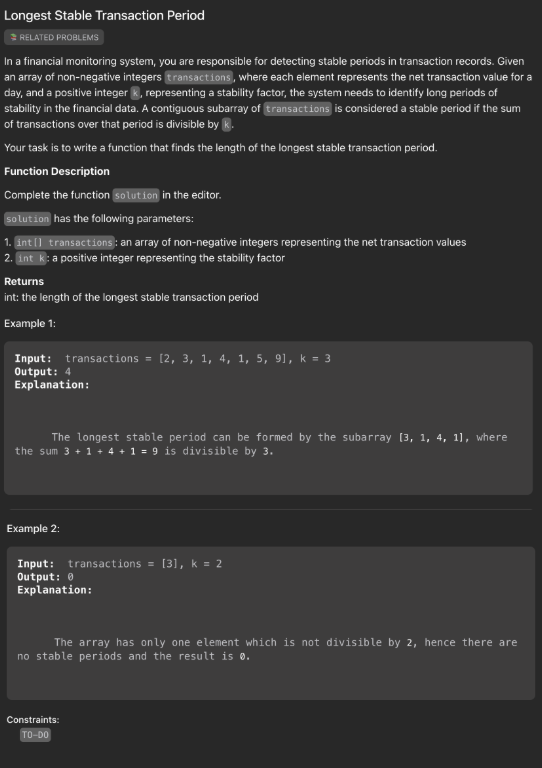
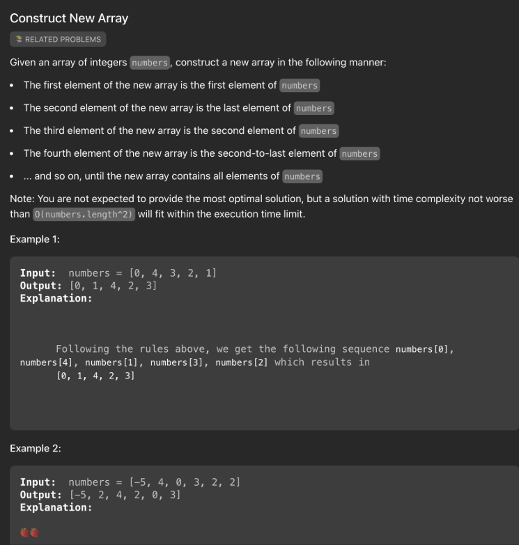
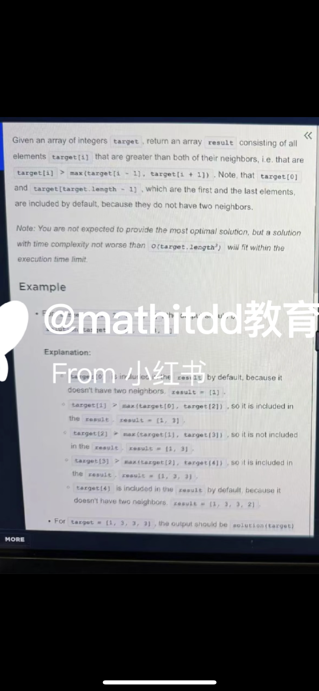
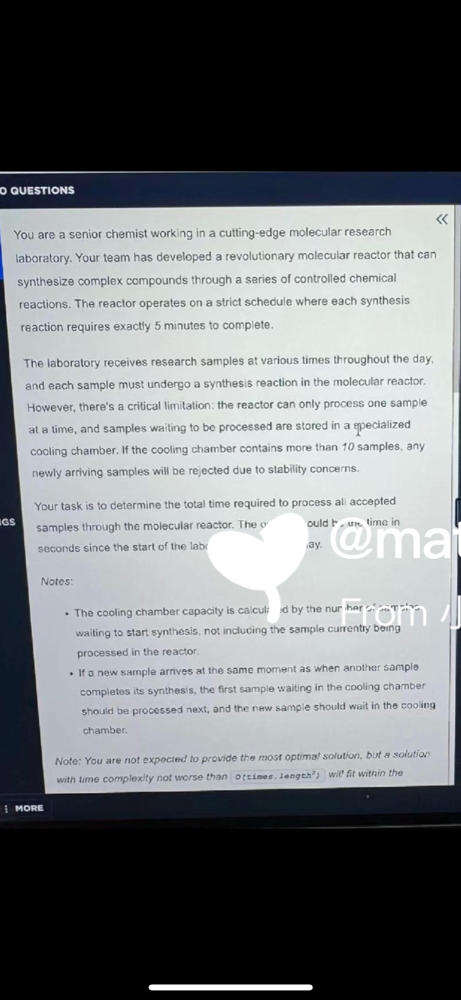
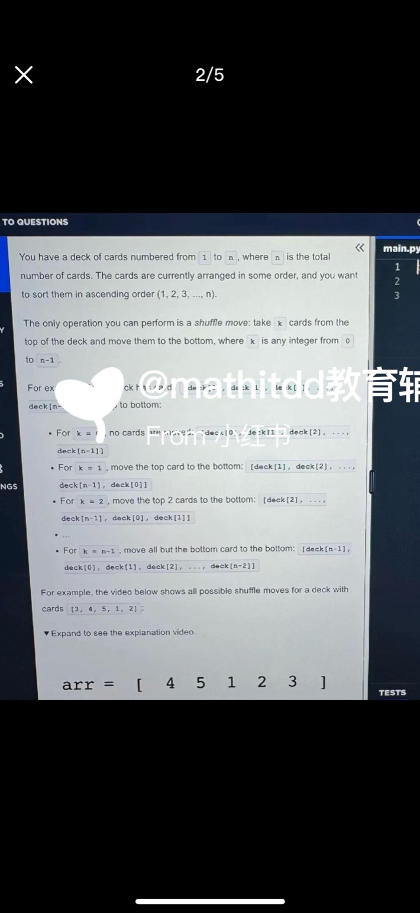

# 2026 Intern OA Prep

### #1 Replace Nth Consonant

```java
public static String replaceNthConsonant(String message, int n) {
        // write your code here
        Set<Character> vowels = new HashSet<>();
        for (char c: "aeiouAEIOU".toCharArray()) vowels.add(c);

        StringBuilder sb = new StringBuilder();
        int count = 0;

        for (char c: message.toCharArray()) {
            // is vowel
            if (vowels.contains(c) || !Character.isLetter(c)) {
                sb.append(c);
                continue;
            }

            count++;
            if (count % n == 0) {
                sb.append(getNextConsonant(c, vowels));
            } else {
                sb.append(c);
            }
        }
        return sb.toString();
}

    private static char getNextConsonant(char c, Set<Character> vowels) {
        boolean isUpper = Character.isUpperCase(c);
        char next = c;

        while (true) {
            next = (char)(next == 'z'? 'a': next == 'Z'? 'A': next+1);
            if (!vowels.contains(next)) {
                return next;
            }
        }
    }

```

### #2 Longest Stable Transaction Period

```java
 public static int duolingoLongestTransaction(int[] transactions, int k) {
        // write your code here
        HashMap<Integer, Integer> map = new HashMap<>(); // <remainder, index>
        map.put(0, 0);
        int sum = 0, res = 0;

        for (int i = 0; i < transactions.length; i++) {
            sum += transactions[i];
            int remainder = sum % k; // or (sum % k + k) % k if there are negative elements
            if (map.containsKey(remainder)) {
                res = Math.max(res, i-map.get(remainder)+1);
            } else {
                map.put(remainder, i+1);
            }
        }
        return res;
    }
```
### #3 Construct New Array


```java
    // 写法一
   public static int[] constructArray(int[] numbers) {
        int n = numbers.length;
        int[] result = new int[n];

        int left = 0, right = n - 1;
        int idx = 0;

        while (left <= right) {
            if (idx % 2 == 0) {
                // 偶数位放左边
                result[idx++] = numbers[left++];
            } else {
                // 奇数位放右边
                result[idx++] = numbers[right--];
            }
        }
        return result;
    }

    // 写法二
public static int[] constructArray(int[] nums) {
    int N = nums.length;
    if (N < 3) return nums;

    int[] res = new int[N];
    int left = 0, right = N-1, idx = 0;

    while (left <= right && idx < N) {
        res[idx++] = nums[left];
        if (left != right) {
            res[idx++] = nums[right];
        }
        left++;
        right--;
    }
    return res;
}

```

### #4 Find peaks in an array


```java
public static int[] findPeaks(int[] nums) {
    int n = nums.length;
    List<Integer> list = new ArrayList<>();
    
    for (int i = 0; i < n; i++) {
        if (i == 0 || i == n - 1) {
            list.add(nums[i]);
        } else if (nums[i] > nums[i - 1] && nums[i] > nums[i + 1]) {
            list.add(nums[i]);
        }
    }
    return list.stream().mapToInt(Integer::intValue).toArray();
}

// 写法二
   public static int[] findPeaks(int[] nums) {
        int n = nums.length;
        if ( n < 3) return nums;
        List<Integer> list = new ArrayList<>();

        for (int i = 0; i < n; i++) {
            if (i == 0 || i == n-1) {
                list.add(nums[i]);
                continue;
            }
            if (nums[i] > nums[i-1] && nums[i] > nums[i+1]) list.add(nums[i]);
        }

        return list.stream().mapToInt(Integer::intValue).toArray();
    }
```

### #5 分子反应器 
- 题意：样本依次到达，反应器一次只能处理一个，没空时进冷却室队列（最大容量 10），否则拒绝。问所有被接受样本的总处理完成时间。 

- 思路：维护反应器结束时间和队列。到达时若队列满则拒绝；若反应器空闲直接处理，否则入队；处理完再取队列。累计完成时间。 这道题用java解答



```java

// 写法一：
public static int totalProcessTime(int[] arrivalTimes) {
       int unitTime = 300;
       int timeForNext = 0;
       int maxSize = 10;
       Deque<Integer> que = new ArrayDeque<>();

       for (int time: arrivalTimes) {
           while (!que.isEmpty() && timeForNext <= time) {
               int cur = que.poll();
               timeForNext = Math.max(timeForNext, cur) + unitTime;
           }

           if (timeForNext <= time) {
               timeForNext = time + unitTime;
           } else {
               if (que.size() < maxSize) {
                   que.offer(time);
               }
           }
       }

       while (!que.isEmpty()) {
           int cur = que.poll();
           timeForNext = Math.max(timeForNext, cur) + unitTime;
       }

       return timeForNext;
    }

// 写法二：
public static int totalProcessTime(int[] arrivalTimes) {
        final int PROCESS_TIME = 300; // 5 minutes = 300 seconds
        final int MAX_QUEUE = 10;    // cooling chamber capacity

        Deque<Integer> queue = new ArrayDeque<>(); // 存储等待样本的到达时间
        int timeForNext = 0; // 反应器下次可用时间
        int res = 0;      // 最后一个样本完成时间

        for (int t : arrivalTimes) {
            // 如果反应器空闲在样本到达前，就不断从队列里取样本处理
            while (!queue.isEmpty() && timeForNext <= t) {
                int sampleArrive = queue.poll();
                timeForNext = Math.max(timeForNext, sampleArrive) + PROCESS_TIME;
                res = timeForNext;
            }

            // 现在处理新样本
            if (timeForNext <= t) {
                // 反应器空闲，直接处理
                timeForNext = t + PROCESS_TIME;
                res = timeForNext;
            } else {
                // 反应器忙，新样本进冷却队列
                if (queue.size() < MAX_QUEUE) {
                    queue.offer(t);
                } else {
                    // 队列满，样本被拒绝
                }
            }
        }

        // 处理队列里剩下的样本
        while (!queue.isEmpty()) {
            int sampleArrive = queue.poll();
            timeForNext = Math.max(timeForNext, sampleArrive) + PROCESS_TIME;
            res = timeForNext;
        }

        return res;
    }
```

### #6 最长子数组和
题意：给数组 dataSizes 和整数 threshold，求最长连续子数组，使得子数组和与它前面前缀和的差 ≤ threshold。若不存在返回 0

```java
public static int LongestSubarraySum(int[] nums, int k) {
    // <= k 的最长连续subarray长度
    int left = 0, sum = 0, res = 0;

    for (int i = 0; i < nums.length; i++) {
        sum += nums[i];   // 扩展窗口右边

        // 收缩左边直到窗口和 <= k
        while (sum > k && left <= i) {
            sum -= nums[left++];
        }

        // 现在窗口 [left..i] 的和 <= k
        res = Math.max(res, i - left + 1);
    }
    return res;
}
```

### #7 move careds
牌堆含1到n，移前k张到牌底，求最小k使牌堆有序；无解返-1。 - 思路：构建目标数组[1..n]，试k=0到n-1，模拟旋转后对比目标，首个匹配k即返回，否则返-1. 



```java
 public static int minShuffleToSort(int[] arr) {
        int n = arr.length;
        int idx = -1;
        
        for (int i = 0; i < n; i++) {
            if (arr[i] == 1) {
                idx = i;
                break;
            }
        }
        
        for (int i = 0; i < n; i++) {
            int shouldBe = i+1;
            int cur = arr[(idx + i) % n];
            if (cur != shouldBe) return -1;
        }
        return idx;
    }
```
