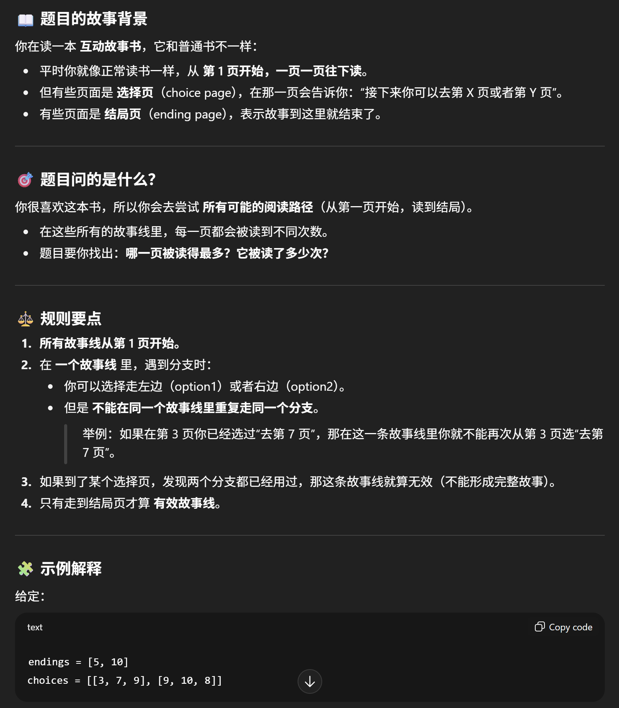

# 2026 Intern Karat

## #1 

- You are reading a Build Your Own Story book. It is like a normal book except that choices on some pages affect the story, sending you to one of two options for your next page.
The choices are provided in a list, sorted by the page containing the choice, and each choice has two options of pages to go to next. In this example, you are on page 3, where there is a choice. Option 1 goes to page 14 and option 2 goes to page 2.
choices = [[3, 14, 2]] => [current_page, first_choice, second_choice]
You start reading at page 1 and read forward one page at a time unless you reach a choice or an ending.

- You really love this book and so you decide to read all possible story sequences. You notice that you are reading some pages more than others, so you want to find out which page you have read the most often when you read every storyline that leads to an ending.
You set some rules for your reading to avoid repeating pages too often. These rules are:
    - 1) All storylines start at page 1.
    - 2) Within any one storyline, you will never make the same choice twice (you may choose the other option)
    - 3) If you reach a choice where you've already made both choices, you will not reach an ending, so this is not a valid storyline.

- Given a list of endings and a list of choices with their destinations, return the page which was read the most often, as well as the number of times it was read. If multiple pages were read the same number of times, you may return any of them. If there are no valid storylines, return -1.

- Example:
endings1 = [5, 10]
choices1_1 = [[3, 7, 9], [9, 10, 8]]
1 -> 2 -> 3(choice) -> 7 -> 8 -> 9(choice) -> 10(ending)
          |                      |
          |                      8 -> 9(choice, can't repeat 8) -> 10
          9(choice) -> 10(ending)
          |
          8 -> 9(choice, can't repeat 8) -> 10
All Storylines:
1->2->3->7->8->9->10
1->2->3->7->8->9->8->9->10
1->2->3->9->10
1->2->3->9->8->9->10
Page reads:
(1:4), (2:4), (3:4), (4:0), (5:0), (6:0), (7:2), (8:4), (9:6), (10:4)
Page with most reads = Page: 9, Reads: 6 (outputs can be in any format)

### 分析



```java


```