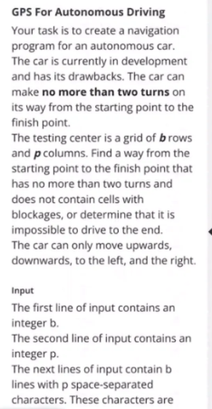
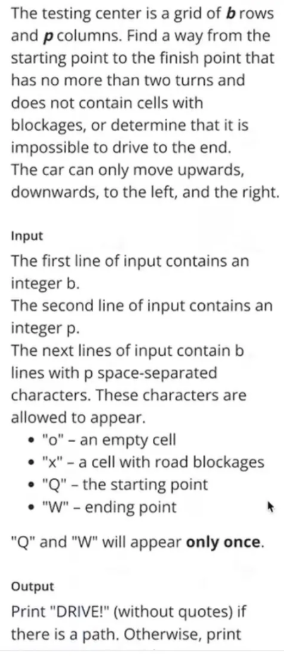
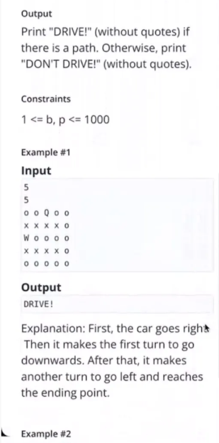
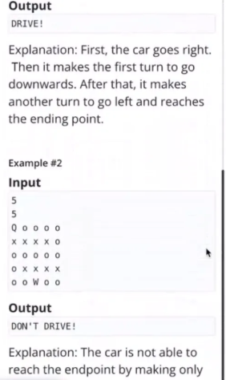
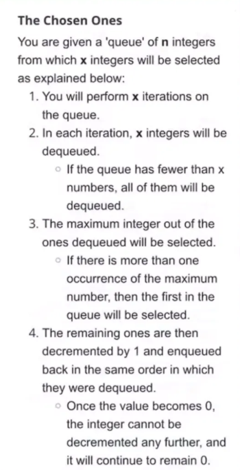
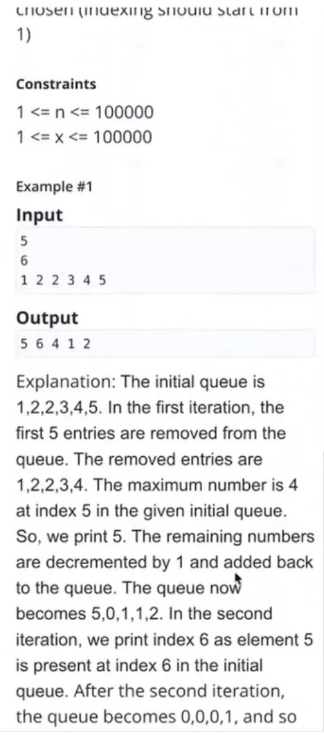

## GPS for Autonomous Driving





```java
public class Main {
    public static void main(String[] args) {
        Scanner sc = new Scanner(System.in);

        int rows = sc.nextInt();
        int cols = sc.nextInt();
        sc.nextLine(); // eat newline
        char[][] a = new char[rows][cols];

        // read each row (space-separated characters)
        for (int i = 0; i < rows; i++) {
            String[] parts = sc.nextLine().trim().split(" ");
            for (int j = 0; j < cols; j++) {
                a[i][j] = parts[j].charAt(0);
            }
        }

        String result = solve(a);
        System.out.println(result);

    }

    static class State {
        int r, c, dir, turns;
        State(int r, int c, int dir, int turns) {
            this.r = r;
            this.c = c;
            this.dir = dir;     // -1 = start
            this.turns = turns;
        }
    }

    public static String solve(char[][] grid) {
        int rows = grid.length;
        int cols = grid[0].length;

        int startR = -1, startC = -1;
        int endR = -1, endC = -1;

        for (int i = 0; i < rows; i++) {
            for (int j = 0; j < cols; j++) {
                if (grid[i][j] == 'Q') {
                    startR = i;
                    startC = j;
                }
                if (grid[i][j] == 'W') {
                    endR = i;
                    endC = j;
                }
            }
        }

        // Direction vectors: 0=up, 1=down, 2=left, 3=right
        int[] dr = {-1, 1, 0, 0};
        int[] dc = {0, 0, -1, 1};

        // Map to track visited states: "r,c,dir,turns"
        Set<String> visited = new HashSet<>();

        Queue<State> queue = new LinkedList<>();
        queue.offer(new State(startR, startC, -1, 0));
        visited.add(startR + "," + startC + "," + (-1) + "," + 0);

        while (!queue.isEmpty()) {
            State curr = queue.poll();

            if (curr.r == endR && curr.c == endC) {
                return "DRIVE!";
            }

            for (int d = 0; d < 4; d++) {
                int nr = curr.r + dr[d];
                int nc = curr.c + dc[d];

                if (nr < 0 || nr >= rows || nc < 0 || nc >= cols) continue;
                if (grid[nr][nc] == 'x') continue;

                int newTurns = curr.turns;
                if (curr.dir != -1 && curr.dir != d) {
                    newTurns++;
                }

                if (newTurns > 2) continue;

                String key = nr + "," + nc + "," + d + "," + newTurns;
                if (!visited.contains(key)) {
                    visited.add(key);
                    queue.offer(new State(nr, nc, d, newTurns));
                }
            }
        }

        return "DON'T DRIVE!";
    }
}
```

## The chosen one


