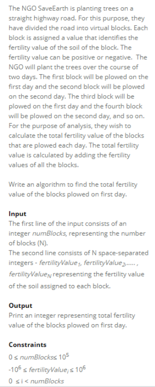
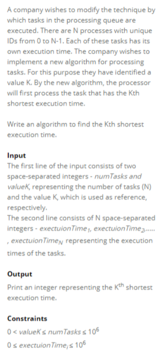

### 1. Remove Vowels from a String
```java
public static String replaceAllVowels(String s) {
    String vowels = "AEIOUaeiou";
    Set<Character> set = new HashSet<>();
    for (char c : vowels.toCharArray()) {
        set.add(c);
    }

    StringBuilder sb = new StringBuilder();
    for (char c : s.toCharArray()) {
        if (!set.contains(c)) { // keep only non-vowels
            sb.append(c);
        }
    }

    return sb.toString();
}
```

### 2. 求数组的众数和平均数
```java
private static double calculateMean(int[] nums) {
    long sum = 0;

    for (int num: nums) {
        sum += (long) num;
    }

    return (double)sum / nums.length;
}

private static int findMode(int[] nums) {
    Map<Integer, Integer> map = new HashMap<>(); // <num, count>
    int count = 0, mode = 0;

    for (int num: nums) {
        map.put(num, map.getOrDefault(num, 0)+1);
        if (map.get(num) > count) {
            count = map.get(num);
            mode = num;
        }
    }
    return mode;
}
```

### 3. 找array的 GCD
```java
 private static int findGCD(int[] nums) {
       int res = nums[0];

       for (int i = 1; i < nums.length; i++) {
            res = calculateGCD(res, nums[i]);
       }
       return res;
    }

    private static int calculateGCD(int a, int b) {
       while (b != 0) {
           int temp = b;
           b = a % b;
           a = temp;
       }
       return a;
    }
```

### 4. 升序排列array后间隔一个元素打印
升序数组后每隔一个数存一个数到array中；给定一个数组，首先需要将数组排列，然后将排列后的数组，从头开始遍历，每隔一个element就将下一个element存到一个新的数组里，最后返回新的数组，比如给定 arr = [3,5,12,2,5], return = [2,5,12]

```java
private static int[] printArray(int[] nums) {
    Arrays.sort(nums);
    List<Integer> list = new ArrayList<>();

    for (int i = 0; i < nums.length; i+= 2) {
        list.add(nums[i]);
    }

    int[] res = new int[list.size()];
    for (int i = 0; i < list.size(); i++) {
        res[i] = list.get(i);
    }

    return res;
}
```

### 5. parent string里sub string出现的次数
查找字符串出现substring的次数；给予两个string，返回第二个string在第一个string中出现的次数. I was given two string inputs. If I remember correctly one input was the secret code so like ‘tom’ and you are suppose to find the amount of times it appears in the second input which would look something like this ‘tomfjekxhrkftomfefjsebfqtom’.

```java
 public static int countOccurrences(String text, String word) {
        int length = word.length();
        int i = 0, count = 0;

        while (i+length <= text.length()) {
            String str = text.substring(i, i+length);
            if (str.equals(word)) {
                count++;
                i = i+length; // i++ if ovelapping allows
            } else {
                i++;
            }
        }
        return count;
}
```

### 6. printFertilityDayOneValue



```java
 private static void printFertilityDayOneValue() {
    Scanner sc = new Scanner(System.in);
    int numBlocks = sc.nextInt();
    int[] fertility = new int[numBlocks];

    for (int i = 0; i < numBlocks; i++) {
        fertility[i] = sc.nextInt();
    }

    int sum = 0;
    for (int i = 0; i < numBlocks; i += 2) {
        sum += fertility[i];
    }

    System.out.println(sum);
}
```

### 7. findKthExcutionTime

```java
  public static void findKthTime() {
        Scanner sc = new Scanner(System.in);
        int numTasks = sc.nextInt();
        int k = sc.nextInt();
        int[] executionTimes = new int[numTasks];
        
        for (int i = 0; i < numTasks; i++) {
            executionTimes[i] = sc.nextInt();
        }
        
        Arrays.sort(executionTimes);
        System.out.println(executionTimes[k-1]);
    }
```
