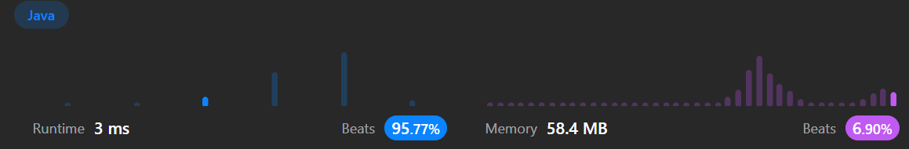

# 11. Container With Most Water

[Leetcode 11 (Medium)][11]

[11]: https://leetcode.com/problems/container-with-most-water/description/?envType=study-plan-v2&envId=leetcode-75



## Approach 1
- two pointers, one at beginning and the other at end. Only move start when height[start] < height[end], and everytime move compare new area and the old maxArea

```java
// time: O(n), where n is the number of elements in the height array. 
// space: O(1), which means the algorithm uses a constant amount of extra space regardless of the input size. 
class Solution {
    public int maxArea(int[] height) {
       int start = 0;
       int end = height.length-1;
       int maxArea = 0;

       while (start < end) {
           if (height[start] < height[end]) {
               maxArea = Math.max(maxArea, height[start] * (end - start));
               start++;
           } else {
               maxArea = Math.max(maxArea, height[end] * (end - start));
               end--;
           }
       }
       return maxArea;
    }
}

// a very similar one
class Solution {
    public int maxArea(int[] height) {
        int left = 0;                   // Left pointer starting from the leftmost edge
        int right = height.length - 1;  // Right pointer starting from the rightmost edge
        int maxWater = 0;               // Initialize the maximum water capacity
        
        while (left < right) {
            // Calculate the width of the container
            int width = right - left;
            
            // Calculate the height of the container (the minimum height between the two lines)
            int h = Math.min(height[left], height[right]);
            
            // Calculate the water capacity of the current container
            int water = width * h;
            
            // Update the maximum water capacity if the current container holds more water
            maxWater = Math.max(maxWater, water);
            
            // Move the pointers towards each other
            if (height[left] < height[right]) {
                left++;
            } else {
                right--;
            }
        }
        
        return maxWater;
    }
}
```