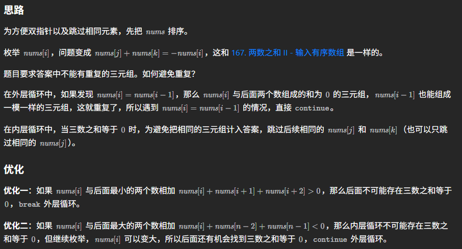
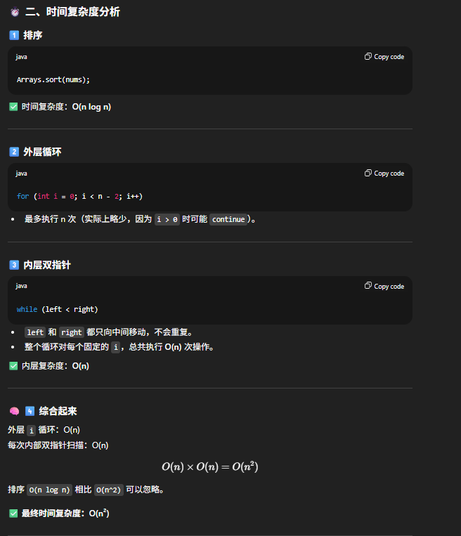
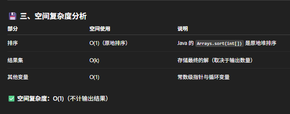

# 15. 3Sum

[Leetcode 15 (Medium)][15]

[15]: https://leetcode.com/problems/3sum/

[Video tutorial][1]

[1]: https://www.youtube.com/watch?v=zQDbMjNsuvY&t=265s



```java
// two pointers (推荐解法)
class Solution {
    public List<List<Integer>> threeSum(int[] nums) {
        int n = nums.length;
        List<List<Integer>> res = new ArrayList<>();
        Arrays.sort(nums);

        // corner case
        if (nums[0] > 0) return res;

        for (int i = 0; i < n-2; i++) {
            int num1 = nums[i];
            if (i > 0 && nums[i] == nums[i-1]) continue; // skip duplicates
            if (num1 + nums[i+1] + nums[i+1] > 0) break; // 优化一
            if (num1 + nums[n-2] + nums[n-1] < 0) continue; // 优化二
            
            int target = 0-num1;
            int left = i+1, right = n-1;

            while (left < right) {
                if (nums[left] + nums[right] > target) {
                    right--;
                } else if (nums[left] + nums[right] < target) {
                    left++;
                } else {
                    res.add(new ArrayList<>(Arrays.asList(num1, nums[left++], nums[right--])));
                    while (left < right && nums[left] == nums[left-1]) left++; // skip duplicates
                    while (left < right && nums[right] == nums[right+1]) right--; // skip duplicates

                }
            }
        }
        return res;
    }
}

// two pointers
class Solution {
    public List<List<Integer>> threeSum(int[] nums) {
        Arrays.sort(nums);
        List<List<Integer>> res = new ArrayList<>();
        
        for (int i = 0; i < nums.length; i++) {
            if (i > 0 && nums[i] == nums[i-1]) {
                continue;
            }
            find3Sum(nums, i, res);
        }
        return res;
    }

     public void find3Sum(int[] nums, int i, List<List<Integer>> res) {
        int left = i+1, right = nums.length-1;

        while (left < right) {
            int sum = nums[i] + nums[left] + nums[right];
            if (sum > 0) {
                right--;
            } else if (sum < 0) {
                left++;
            } else {
                res.add(Arrays.asList(nums[i], nums[left++], nums[right--]));
                while (right > left && nums[right] == nums[right + 1]) right--;
                while (right > left && nums[left] == nums[left - 1]) left++;
            }

        }
    }
}
// two pointers
class Solution {
    public List<List<Integer>> threeSum(int[] nums) {
        List<List<Integer>> res = new ArrayList<>();
        Arrays.sort(nums);

        for (int i = 0; i < nums.length; i++) {
            // 去重
            if (i > 0 && nums[i] == nums[i-1]) {
                continue; //只能是continue，如果是i++，那么target也需要更新
            }
            findTwoSum(nums, i, res);
        }
        return res;
    }

    public void findTwoSum(int[] nums, int i, List<List<Integer>> res) {
        int target = -nums[i];
        int left = i+1, right = nums.length-1;
        while (left < right) {
            int sum = nums[left] + nums[right];
            if (sum < target) {
                left++;
            } else if (sum > target) {
                right--;
            } else {
                res.add(new ArrayList<>(Arrays.asList(nums[i], nums[left++], nums[right--])));
                // 去重，只有找到target的时候才需要去重
                while (left < right && nums[left] == nums[left-1]) {
                    left++; // 可以移动左边也可以移动右边或者两边
                }
            }
        }
    }
}

// HashMap
class Solution {
    public List<List<Integer>> threeSum(int[] nums) {
        List<List<Integer>> res = new ArrayList<>();
        HashMap<Integer, Integer> map = new HashMap<>();
        for (int num : nums) map.put(num, map.getOrDefault(num, 0) + 1); //nums[i]及其出现次数

        Arrays.sort(nums);

        for (int i = 0; i < nums.length; i++) {
            if (i > 0 && nums[i] == nums[i-1]) continue; //去重, 每一个位置只取第一次出现的数
            for (int j = i+1; j < nums.length; j++) {
                if (j> i+1 && nums[j] == nums[j-1]) continue; //去重
                int target = 0 - nums[i] - nums[j]; 
                if (!map.containsKey(target)) continue;
                if (target < nums[j]) continue;
                int count1 = (nums[i] == target)? 1:0;
                int count2 = (nums[j] == target)? 1:0;
                if (map.get(target) >= 1 + count1 + count2) {
                    res.add(new ArrayList<>(Arrays.asList(nums[i], nums[j], target)));
                }
            }
        }
        return res;
    }
}

```


