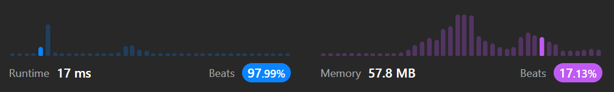

# 1679. Max Number of K-Sum Pairs

[Leetcode 1679 (Medium)][1679]

[1679]: https://leetcode.com/problems/max-number-of-k-sum-pairs/description/



## Approach 1
- 这道题和11. Container With Most Water_medium及其类似，都是头尾各一个pointer, nums[start] and nums[end] 需要合起来计算一个参数，如果小了 start++, 大了就end--;
- 这里非常容易出错的是end--, 很容易不小心写成end++; 

```java
// time: O(nlogn) ;
// space: O(1);
class Solution {
    public int maxOperations(int[] nums, int k) {
        int count = 0;
        int start = 0, end = nums.length-1;

        Arrays.sort(nums);

        while (start < end) {
            if (nums[start] + nums[end] == k) {
                count++;
                start++;
                end--;
            } else if (nums[start] + nums[end] < k) {
                start++;
            } else {
                end--;
            }
        }
        return count;
    }
}


```