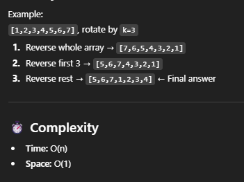

# 189. Rotate Array

## Approach 1 (推荐)



```java
class Solution {
    public void rotate(int[] nums, int k) {
        int n = nums.length;
        k = k % n;  // avoid unnecessary full rotations

        reverse(nums, 0, n - 1);
        reverse(nums, 0, k - 1);
        reverse(nums, k, n - 1);
    }

    private void reverse(int[] nums, int left, int right) {
        while (left < right) {
            int temp = nums[left];
            nums[left] = nums[right];
            nums[right] = temp;
            left++;
            right--;
        }
    }
}
```

## Approach 2 - using extra array
- We use an extra array in which we place every element of the array at its correct position i.e. the number at index i in the original array is placed at theindex (i+k)% length of array.
- Then, we copy the new array to the original one.
- time: O(N)
- space: O(N)

```java
class Solution {
    public void rotate(int[] nums, int k) {
        int[] arr = new int[nums.length];

        for (int i = 0; i < nums.length; i++) {
            arr[(i+k) % nums.length] = nums[i];
        }

        
        for (int i = 0; i < nums.length; i++) {
            nums[i] = arr[i];
        }        
    }
}
```


