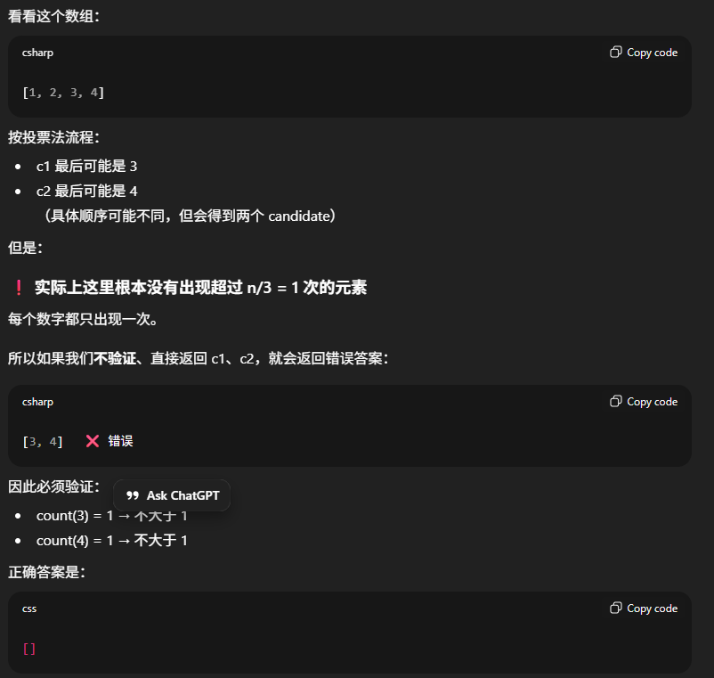
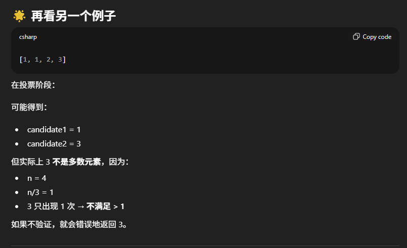

# 229. Majority Element II

## Approach - Boyer–Moore 投票算法
这道题的难点是时间复杂度O(n)以及空间复杂度O(1)

- andidate 最多只有 2 个， 因为如果有 3 个不同的元素，都想出现超过 n/3 次三者相加 > n，不可能。
- 第一轮遍历找出两个可能的 candidate；
- 第二轮遍历再统计验证它们的次数是否超过 n/3。
    - Boyer–Moore 投票法选出来的 candidate 只是“可能的多数元素”，但不保证一定是真的多数元素。 投票阶段只能保证：真正的多数元素一定在候选列表里。但候选列表里的元素不一定真正是多数元素。所以我们必须用第二次遍历来验证它们的出现次数。




```java


```