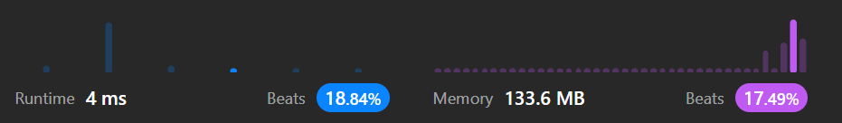

# 334. Increasing Triplet Subsequence

[Leetcode 334 (Medium)][334]

[334]: https://leetcode.com/problems/increasing-triplet-subsequence/description/?envType=study-plan-v2&envId=leetcode-75

## Approach 1

### Intuition
- small is the smallest value encountered so far.
- mid is the second smallest value encountered so far.
- If a value is found that is smaller than or equal to small, update small.
- If a value is found that is greater than small but smaller than or equal to mid, update mid.
- If a value is found that is greater than both small and mid, then we have found an increasing triplet subsequence, and the function returns true.

### Analysis
- Initialization:
  - Initialize two variables, small and mid, to Integer.MAX_VALUE. These variables will be used to keep track of the two smallest elements in the array. The loop variable big will iterate through the array.

- Iteration:
  - Iterate through the array, and for each element big, perform the following checks:
  - If big is less than or equal to the current value of small, update small to be equal to big. This ensures that small always holds the smallest value encountered so far.
  - If big is greater than small but less than or equal to mid, update mid to be equal to big. This ensures that mid always holds the second smallest value encountered so far.
  - If big is greater than both small and mid, then we have found a triplet subsequence, and the function returns true.

- Result:
  - If the loop completes without finding a triplet subsequence, return false.

```java
//time: O(n);
//space: O(1)
public class Solution {
    public boolean increasingTriplet(int[] nums) {
        int small = Integer.MAX_VALUE;
        int mid = Integer.MAX_VALUE;

        for(int big : nums) {
            if(big <= small) {
                small = big;
            }
            else if(big <= mid) {
                mid = big;
            }
            else return true;
        }
        return false;
    }
}
```

## Approach 2


```java
class Solution {
    public boolean increasingTriplet(int[] nums) {
        if (nums.length < 3) return false;

        int small = Integer.MAX_VALUE; //2147483647
        int middle = Integer.MAX_VALUE;

        for (int i = 0; i < nums.length; i++) {
            if (nums[i] < small) {
                small = nums[i];
            } else if (nums[i] > small && nums[i] < middle) {
                middle = nums[i];
            } else if (nums[i] > middle) {
                return true;
            }
                
        }
        return false;
    }
}
```