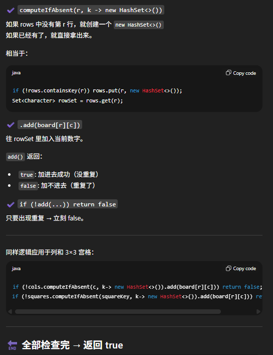

# 36. Valid Sudoku

## Approach 1 - Brute Forece by Neetcode - Liked this method most

```java
class Solution {
    public boolean isValidSudoku(char[][] board) {
        // rows
        for (int i = 0; i < 9; i++) {
            Set<Integer> set = new HashSet<>();
            for (int j = 0; j <9; j++) {
                if (!isValid(i, j, board, set)) return false;
            }
        }

        // cols
        for (int j = 0; j < 9; j++) {
            Set<Integer> set = new HashSet<>();
            for (int i = 0; i < 9; i++) {
                 if (!isValid(i, j, board, set)) return false;
            }
        }

        // square
        for (int square = 0; square < 9; square++) {
            Set<Integer> set = new HashSet<>();
            for (int i = 0; i < 3; i++) {
                for (int j = 0; j < 3; j++) {
                    int row = (square / 3) * 3 + i; // 很好的方法来move to 下一个square
                    int col = (square % 3) * 3 + j;
                    if (!isValid(row, col, board, set)) return false;
                }
            }
        }
        return true;
    }

    private boolean isValid(int row, int col, char[][] board, Set<Integer> set) {
        if (board[row][col] == '.') return true;

        int num = board[row][col] - '0';
        return num > 0 && num < 10 && set.add(num);
    }
}
```

## Appraoch 3 - one pass

- 用三个 HashMap 分别记录：
    - 每一行出现过的数字
    - 每一列出现过的数字
    - 每一个 3×3 小方格出现过的数字
    - 只要某个数字出现重复 → 立刻返回 false。

    

- 解法的一个难点是squarekey 为什么要用 r/3 + "," + c/3 而不是直接用 r + "," + c？
    - 我们总共有9个squares 我们需要9个unique string去代表这九个square, 如果直接用r + "," + c那就要无数个unique string
    - 我们需要对同一个square里面的9个各自的row & cell 都能计算出一个共同的String, 所以采用r/3 + "," + c/3

```java
class Solution {
    public boolean isValidSudoku(char[][] board) {
        Map<Integer, Set<Character>> rows = new HashMap<>();
        Map<Integer, Set<Character>> cols = new HashMap<>();
        Map<String, Set<Character>> squares = new HashMap<>();

        for (int r = 0; r < 9; r++) {
            for (int c = 0; c < 9; c++) {
                if (board[r][c] == '.') continue;

                String squareKey = r/3 + "," + c/3;
                if (!rows.computeIfAbsent(r, k -> new HashSet<>()).add(board[r][c])) return false;
                if (!cols.computeIfAbsent(c, k-> new HashSet<>()).add(board[r][c])) return false;
                if (!squares.computeIfAbsent(squareKey, k-> new HashSet<>()).add(board[r][c])) return false;
            }
        }
        
        return true; 
    }
}
```