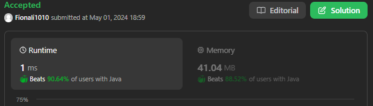

# 392. Is Subsequence

[Leetcode 392 (Easy)][392]

[392]: https://leetcode.com/problems/is-subsequence/

## Approach 1

```java
class Solution {
    public boolean isSubsequence(String s, String t) {
      int tIdx = 0, sIdx = 0;

        while (sIdx < s.length() && tIdx < t.length()) {
            while (tIdx < t.length() && t.charAt(tIdx) != s.charAt(sIdx)) {
                tIdx++;
            }
            if ( tIdx < t.length() && t.charAt(tIdx) == s.charAt(sIdx)) {
                tIdx++;
                sIdx++;
            }
        }
        return sIdx == s.length();

    }
}
```

## Approach 2



```java
class Solution {
    public boolean isSubsequence(String s, String t) {

        boolean res = false;
        int i = 0;
        int j = 0;
        int length = s.length();

        while ( i < t.length() && j < s.length()) {
            if (t.charAt(i) != s.charAt(j)) i++;
            else {
                length -= 1;
                j++;
                i++;
            }
        }
        return length == 0;
    }
}
```