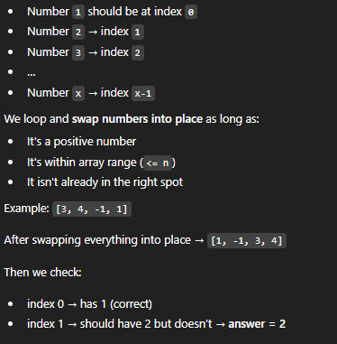
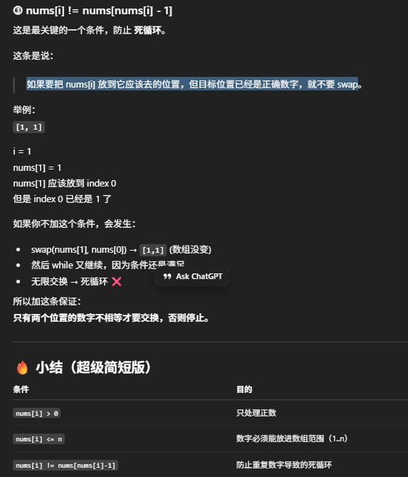

# 41. First Missing Positive

- For an array of length n, the first missing positive must be in [1, n+1], 这个是比较难想到的
    - There are only n valid positions for numbers 1..n
    - If all of them are filled correctly, the smallest missing must be n+1
    - Or the missing possitive should be x >= 1 && x < n+1
- So we try to put each number in its correct position
    - index 0 --> 1
    - index 1 --> 2, ect.
- Check for any number who's not in the correct position and the missing number is the answer
- time: O(n)
- space: O(1)




```java
class Solution {
    public int firstMissingPositive(int[] nums) {
        int n = nums.length;

         // Step 1: Put each number in its correct index
        for (int i = 0; i < n; i++) {
             // 只要当前数字 nums[i] 可以被放到正确的位置，就不断 swap，直到不能再 swap 为止
                // nums[i] > 0：只有正数 才有关“它应该放到哪个 index， 负数和 0 都是无效数字，没必要交换
                // nums[i] <= n：因为数组长度是 n，有效的正数范围是 1…n， 超过这个范围的数，比如n+1 or 10000, 都不可能成为 first missing positive，也无法被放到某个正确 index
                // nums[i] != nums[nums[i] - 1]: 这是最关键的一个条件，防止死循环, 如果要把 nums[i] 放到它应该去的位置，但目标位置已经是正确数字，就不要 swap, 也不用担心出错 num[i] at least 会等于1， nums[1-1], or nums[0];
            while (nums[i] > 0 && nums[i] <= n && nums[i] != nums[nums[i]-1]) {
                int j = nums[i] - 1;
                swap(i, j, nums);
            }
        }

         // Step 2: find the first index where the number is wrong
        for (int i = 0; i < n; i++) {
            if (nums[i] != i+1) return i+1;
        }

        // if all positions are correct, answer is n+1
        return n+1;
    }

    private void swap(int i, int j, int[] nums) {
        int temp = nums[i];
        nums[i] = nums[j];
        nums[j] = temp;
    }
}

```