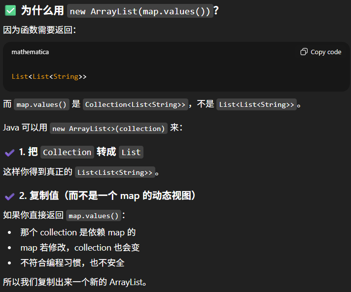

# 49. Group Anagrams

## Approach 1
- 关键在于把每一个str转成arr, sort aray, 再把sorted array convert to String using new String(chars), then use this new string as key, so if they are group anagrams, they should have the same key
- time: O(nklogk)
- space: O(nk)

```java
class Solution {
    public List<List<String>> groupAnagrams(String[] strs) {
        Map<String, List<String>> map = new HashMap<>();

        for (String str: strs) { // o(n), n = strs.length;
            char[] chars = str.toCharArray(); //o(k)
            Arrays.sort(chars); // o(logk)
            String key = new String(chars); /// O(k)

            map.computeIfAbsent(key, k -> new ArrayList<>()).add(str); 
        }

        return new ArrayList(map.values());
    }
}
```

