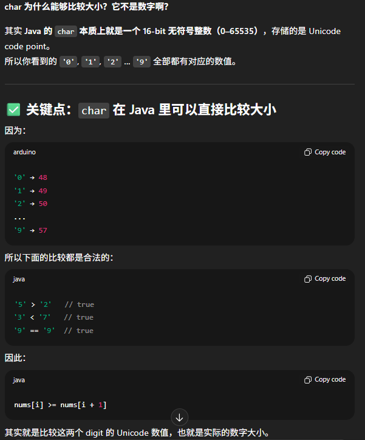

# 556. Next Greater Element III

这道题和31.next permutation 解决方法基本一样

## Approach
给一个整数 n，找它的 下一个更大的 permutation。本质就是对 n 的所有 digits 做：
- 从右往左找第一个下降点（digits[i] < digits[i+1]）如果找不到 → 已经是最大 permutation，返回 -1
- 从右往左找第一个比 digits[i] 大的元素（最小的大于它的）交换两者
- 把 i 右边的部分升序排序（因为之前是降序的，把它 reverse 即可）
- 注意结果可能会 overflow 32-bit → 超过 Integer.MAX_VALUE 返回 -1

- time: O(N)
- space: O(1)

```java
class Solution {
    public int nextGreaterElement(int n) {
        // covert n to char[]
        // find the pivot from right to left, the first decreasing number, if not, return -1
        // from index [i+1, n-1] find the smallest number > pivot, swap
        // reverse the order for index [i+1, n-1]
        // check if overflow

        // 1. convert n to charArray;
        char[] nums = String.valueOf(n).toCharArray();
        int N = nums.length;
        int i = N - 2;

        // 2. find the pivot
        while (i >= 0 && nums[i] >= nums[i+1]) i--;
        if (i < 0) return -1;

        // 3. find the smallest number > pivot and swap
        int j = N - 1;
        while (j > i && nums[j] <= nums[i]) j--;
        swap(nums, i, j);

        // 4. reverse the partial array on the right side of pivot
        reverse(nums, i+1, N-1);

        // 5. check overflow
        try {
            return Integer.parseInt(new String(nums));
        } catch(Exception e) {
            return -1;
        }
    }

    private void reverse(char[] nums, int left, int right) {
        while (left < right) {
            swap(nums, left++, right--);
        }
    }

    private void swap (char[] nums, int a, int b) {
        char temp = nums[a];
        nums[a] = nums[b];
        nums[b] = temp;
    }
}
```

