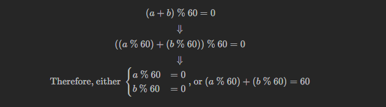

# 560. Subarray Sum Equals K

## Approach 1 - hashmap

```java
class Solution {
    public int subarraySum(int[] nums, int k) {
        HashMap<Integer, Integer> map = new HashMap<>();
        int curSum = 0;
        int count = 0;

        for (int num: nums) {
            curSum += num;

            if (curSum == k) count++;
            
            count += map.getOrDefault(curSum - k, 0);

            map.put(curSum, map.getOrDefault(curSum, 0)+1);
        }
        return count;
    }
}
```