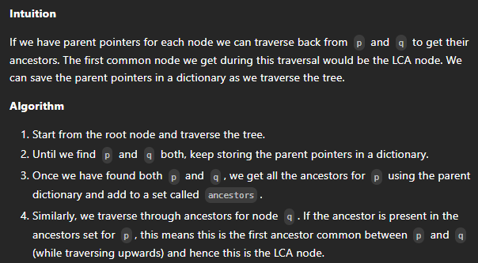
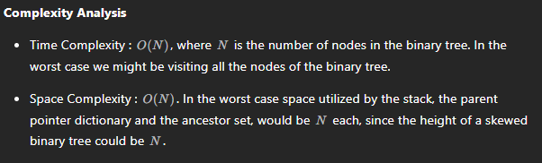

# 724. Find Pivot Index

## Approach 1 by Lei


```java
class Solution {
    public int pivotIndex(int[] nums) {
        int[] prefix = new int[nums.length+1];
        prefix[0] = 0;
        int index = -1;

        for (int i = 1; i < prefix.length; i++) {
            prefix[i] = prefix[i-1] + nums[i-1];
        }

        for (int j = 0; j < nums.length; j++) {
            if (prefix[j] == prefix[prefix.length-1] - prefix[j+1]) {
                index = j;
                break;
            }
        }

        return index;
    }
}
```

## Approach 2 


```java
class Solution {
    public int pivotIndex(int[] nums) {
        // Initialize total sum of the given array...
        int totalSum = 0;
        // Initialize 'leftsum' as sum of first i numbers, not including nums[i]...
        int leftsum = 0;
        // Traverse the elements and add them to store the totalSum...
        for (int ele : nums)
            totalSum += ele;
        // Again traverse all the elements through the for loop and store the sum of i numbers from left to right...
        for (int i = 0; i < nums.length; leftsum += nums[i++])
            // sum to the left == leftsum.
            // sum to the right === totalSum - leftsum - nums[i]..
            // check if leftsum == totalSum - leftsum - nums[i]...
            if (leftsum * 2 == totalSum - nums[i])
                return i;       // Return the pivot index...
        return -1;      // If there is no index that satisfies the conditions in the problem statement...
    }
}
```

##  Approach 3 - interation






```java
class Solution {

    public TreeNode lowestCommonAncestor(TreeNode root, TreeNode p, TreeNode q) {

        // Stack for tree traversal
        Deque<TreeNode> stack = new ArrayDeque<>();

        // HashMap for parent pointers
        Map<TreeNode, TreeNode> parent = new HashMap<>();

        parent.put(root, null);
        stack.push(root);

        // Iterate until we find both the nodes p and q
        while (!parent.containsKey(p) || !parent.containsKey(q)) {

            TreeNode node = stack.pop();

            // While traversing the tree, keep saving the parent pointers.
            if (node.left != null) {
                parent.put(node.left, node);
                stack.push(node.left);
            }
            if (node.right != null) {
                parent.put(node.right, node);
                stack.push(node.right);
            }
        }

        // Ancestors set() for node p.
        Set<TreeNode> ancestors = new HashSet<>();

        // Process all ancestors for node p using parent pointers.
        while (p != null) {
            ancestors.add(p);
            p = parent.get(p);
        }

        // The first ancestor of q which appears in
        // p's ancestor set() is their lowest common ancestor.
        while (!ancestors.contains(q))
            q = parent.get(q);
        return q;
    }

}
```