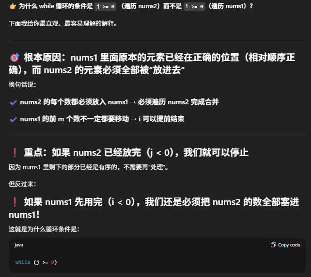

# 88. Merge Sorted Array

[Leetcode 88 (Easy)][88]

[88]: https://leetcode.com/problems/merge-sorted-array/?envType=study-plan-v2&envId=top-interview-150

```java
// Lei's appraoch but write in a more simplied way
   // steps:
       // 1. merge from backwards would be easier to insert number from nums2 to nums1
       // 2. use 3 pointers, i points to end of nums1 (m-1), j points to end of nums2 (n-1), and k (m+n-1) to nums1
       // 3. compare nums1[i] and nums2[j], insert to the end of nums1 and pointers--;
       // 4. while condition: j>=0 for when zero numbers in nums1 and for if condition, added i<0 also for this case.
class Solution {
    public void merge(int[] nums1, int m, int[] nums2, int n) {
        int i = m-1, j = n-1, k = m+n-1;

        // 这道题重点是遍历nums2的每一个数，进行比较，nums1 本来就在原地
        while (j >= 0) {
            if (i < 0 || nums2[j] >= nums1[i]) { // 不要忽略 i < 0 这个条件
                nums1[k--] = nums2[j--];
            } else {
                nums1[k--] = nums1[i--];
            }
        }
    }
}




//Lei's appraoch
class Solution {
    public void merge(int[] nums1, int m, int[] nums2, int n) {
        int size = m + n;
        int i = m - 1; // index for nums1;
        int j = n -1; // index for nums 2;

        for (int k = size-1; k >= 0; k--) {
            if (i < 0 || (j>= 0 && nums2[j] > nums1[i])) {
                nums1[k] = nums2[j];
                j--;
            }
            else if (j < 0 || (i >= 0 && nums2[j] <= nums1[i])){
                nums1[k] = nums1[i];
                i--;
            }
        }
    }
}
```