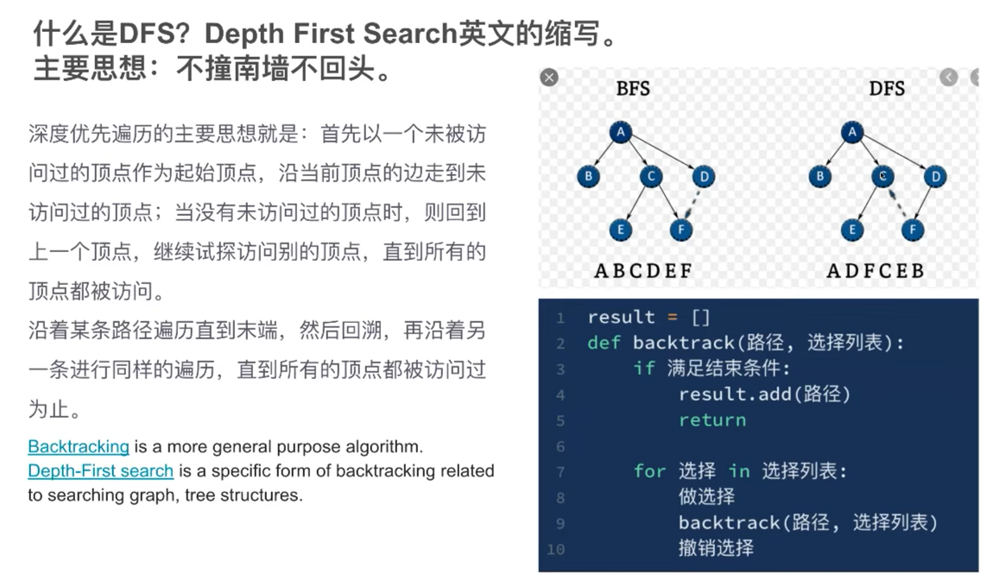
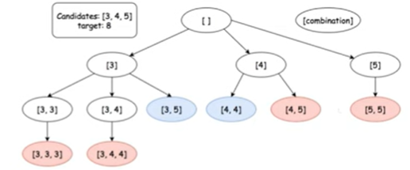
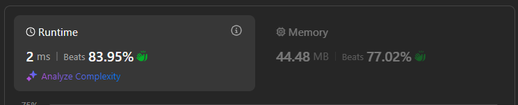

# 39. Combination Sum

Similar problems: 39, 40, 216, 317;

## Approach 1: backtracking






- 数高： Target/最小candidates + 1;
- backtracking: 用于记得走到哪了
- time: 树width * 树height = O(N^树高)



- 这道题告诉我们candidates里面的数字都是unique的，如果不是，我们先对candidates 去重 + sort

```java
class Solution {
    // 不想继续传参数就写在外面；
    int[] candidates;
    int target;
    
    public List<List<Integer>> combinationSum(int[] candidates, int target) {
       this.candidates = candidates;
       this.target = target;
       List<List<Integer>> res = new ArrayList<>();
       
       Arrays.sort(candidates); // 1） 1）2）减少循环, 可加不可加
       dfs(res, new ArrayList<>(), 0 , 0);

       return res;
    }

    private void dfs(List<List<Integer>> res, List<Integer> list, int sum, int start) {
        if (sum == target) {
            res.add(new ArrayList<>(list)); // return copy of the list not the original list as list constantly changes. As list is a referece type, what you put in res will also changes.
            return;
        }
        if (sum > target) return;

        for (int i = start; i < candidates.length; i++) {
            if (candidates[i] > target - sum) break; // 2） 1）2）可加不可加
            
            list.add(candidates[i]);
            dfs(res, list, sum + candidates[i], i);
            list.remove(list.size()-1);
        }
    }  
}
```

- 同样方法，稍微不同写法 (推荐，考虑到尽量不用global variable)

```java
class Solution {
    public List<List<Integer>> combinationSum(int[] candidates, int target) {
        Arrays.sort(candidates);
        List<List<Integer>> res = new ArrayList<>();
        
        dfs(candidates, new ArrayList<Integer>(), target, 0, res);
        return res; 
    }

    private void dfs(int[] candidates, List<Integer> list, int sum, int start, List<List<Integer>> res) {
        if (sum == 0) {
            res.add(new ArrayList<>(list));
            return;
        }

        if (sum < 0) return; // 这一行也可以不要

        for (int i = start; i < candidates.length; i++) {
            if (candidates[i] > sum) break; //这一步可以很大的提高速度
            
            // list.add(candidates[i]);
            // sum -= candidates[i];
            // dfs(candidates, list, sum, i, res);
            // list.remove(list.size()-1);
            // sum += candidates[i];

            // immutable variable (e.g string, int..)写在loop里再放入dfs, 需要backtrack, 直接在dfs 参数里处理就不需要backtrack
            if (candidates[i] > target) break;
            list.add(candidates[i]);
            dfs(candidates, list, target-candidates[i], i, res);
            list.remove(list.size()-1);
        }
    }
}
```