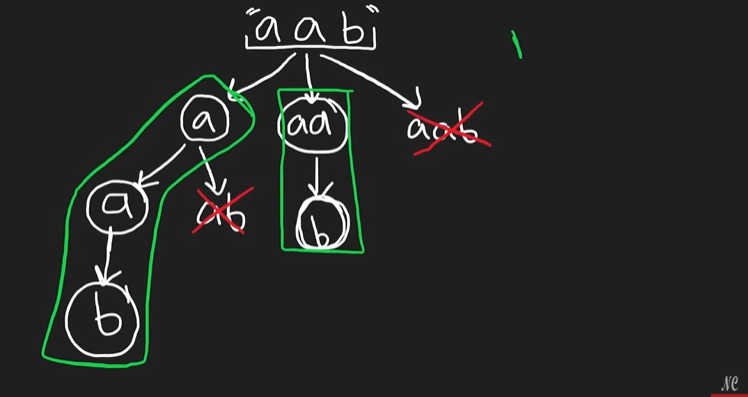

# 131. Palindrome partitioning

## Approach 1 - backtracking

- Recursively breaking s into substrings.
- Checking if each substring is a palindrome.
- If it is, adding it to a temporary list (list).
- If we reach the end of s, adding the current partition to res.
- 如果一个substring不是palindrome
    - 首先，它不会被加入到list里，所以也不用remove
    - 同时这条path 也不会被加入res, 因为有不是palindrome的substring, 所以它不会到达start >= s.length的情况，顶多到达start = s.length-1的情况




```java
class Solution {
    public List<List<String>> partition(String s) {
        List<List<String>> res = new ArrayList<>();

        dfs(s, 0, new ArrayList<String>(), res);
        return res;
    }

    private void dfs(String s, int start, List<String> list, List<List<String>>res) {
        if (start >= s.length()) {
            res.add(new ArrayList<>(list));
            return;
        }

        for (int i = start; i < s.length(); i++) {
            // 如果某一条path
            if (isPalindrome(s, start, i)) {
                list.add(s.substring(start, i+1));
                dfs(s, i+1, list, res);
                list.remove(list.size()-1);
            }
        }
    }
    private boolean isPalindrome(String s, int left, int right) {
        while (left < right) {
            if (s.charAt(left) != s.charAt(right)) return false;
            left++;
            right--;
        }

        return true;
    }
}

```

- time:
- Space: 