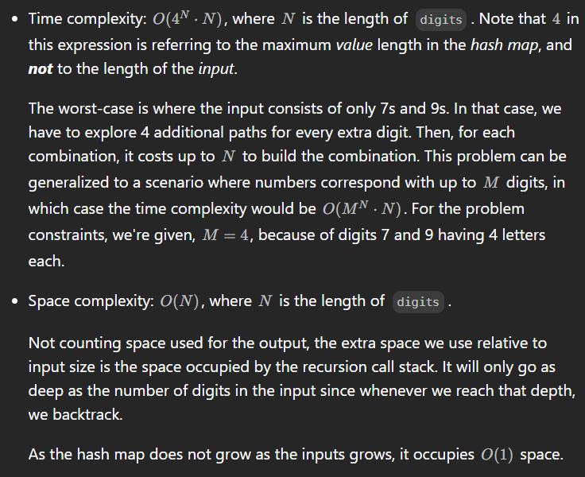

# 17. Letter Combinations of a Phone Number

- Map.of in Java is a convenient way to create immutable maps (i.e., maps that can't be modified after creation). It was introduced in Java 9.

```java
class Solution {;
    private Map<Character, String> map = Map.of(
        '2',
        "abc",
        '3',
        "def",
        '4',
        "ghi",
        '5',
        "jkl",
        '6',
        "mno",
        '7',
        "pqrs",
        '8',
        "tuv",
        '9',
        "wxyz"
    );
    
    // digits = '23'
    public List<String> letterCombinations(String digits) {
        List<String> res = new ArrayList<>();
        if (digits.length() == 0) return res;

        backtrack(digits, 0, new StringBuilder(), res);
        return res;
    }

    public void backtrack(String digits, int i, StringBuilder sb, List<String> res) {
        if (sb.length() == digits.length()) {
            res.add(sb.toString()); // toString() creates a separate copy of current state of sb
            return;
        }

        char digit = digits.charAt(i);
        for (char c: map.get(digit).toCharArray()) {
            sb.append(c);
            backtrack(digits, i+1, sb, res);
            sb.deleteCharAt(sb.length()-1);            
        }
    }
}
```
