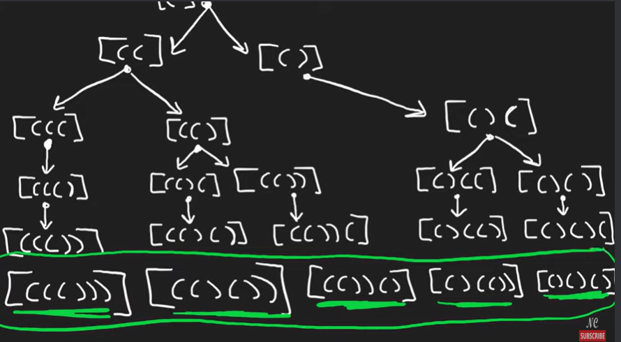

# 22. Generate Parentheses

## Approach 
- 这道题首先要想到backtracking, 因为每一层都有不同的选择，不太容易loop
- rules to add "(" or ")":
    - starting point 为 "(" 不能是 ")"
    - if No.of open brackets > No.of closed brackets, 可以添加closed bracket
    - if No.of open brackets < n, 可以添加 open bracket
    - 同时满足以上两种条件就有两种可能
- base case: 当下string的长度为2n时，add to res




In Java, objects (like List<String>) are passed by reference. So when you pass res into the backtrack() function, you’re passing a reference to the same list — not a copy. That means:
- When any level of the recursive backtrack() method does res.add(...), it modifies the same res list declared at the top level of generateParenthesis.
- There is only one res object in memory, shared by all recursive calls.


### 写法一： StringBuilder

```java
class Solution {
    public List<String> generateParenthesis(int n) {
        List<String> res = new ArrayList<>();
        dfs(res, new StringBuilder(), 0, 0, n);
        return res;
    }

    private void dfs(List<String> res, StringBuilder sb, int open, int close, int n) {
        if (sb.length() == 2 * n) {
            res.add(sb.toString());
            return;
        }

        if (open < n) {
            sb.append('(');
            dfs(res, sb, open+1, close, n);
            sb.deleteCharAt(sb.length()-1);
        }

        if (close < open) {
            sb.append(')');
            dfs(res, sb, open, close+1, n);
            sb.deleteCharAt(sb.length()-1);
        }
    }
}

```

### 写法二： char array

```java
class Solution {
    public List<String> generateParenthesis(int n) {
        List<String> ans = new ArrayList<>();
        char[] path = new char[n * 2]; // 所有括号长度都是一样的 2n
        dfs(0, 0, n, path, ans); // 一开始没有填括号
        return ans;
    }

    // 目前填了 left 个左括号，right 个右括号
    private void dfs(int left, int right, int n, char[] path, List<String> ans) {
        if (right == n) { // 填完 2n 个括号
            ans.add(new String(path));
            return;
        }
        if (left < n) { // 可以填左括号
            path[left + right] = '('; // 直接覆盖
            dfs(left + 1, right, n, path, ans);
        }
        if (right < left) { // 可以填右括号
            path[left + right] = ')'; // 直接覆盖
            dfs(left, right + 1, n, path, ans);
        }
    }
}
```