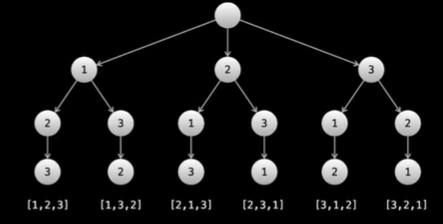

# 46. Permutations （组合， 顺序有关系）



## Approach 1 - backtracking

- 这种方法相比第二种更快， 关键在于我们用什么数据结构去判断某个数字是否已经访问过了
- 相比combination, permutation 不用排序

```java
class Solution {
    public List<List<Integer>> permute(int[] nums) {
        List<List<Integer>> res = new ArrayList<>();
        if (nums == null || nums.length == 0) return res;
        dfs(nums, new boolean[nums.length], new ArrayList<Integer>(), res);
        return res;
    }

    private void dfs(int[] nums, boolean[] visited, List<Integer> list, List<List<Integer>> res) {
        if (list.size() == nums.length) {
            res.add(new ArrayList<>(list));
            return;
        }

        for (int i = 0; i < nums.length; i++) {
            if (visited[i]) continue;
            visited[i] = true;
            list.add(nums[i]);
            dfs(nums, visited, list, res);
            visited[i] = false;
            list.remove(list.size()-1);
        }
    }
}
```

- 时间复杂度：O(n⋅n!)，其中 n 为 nums 的长度。视频中提到，搜索树中的节点个数低于 3⋅n!。实际上，精确值为 ⌊e⋅n!⌋，其中 e=2.718⋯ 为自然常数。有 O(n!) 个叶节点，每个叶节点花费 O(n) 的时间复制 path 数组，因此时间复杂度为 O(n⋅n!)。
- 空间复杂度：O(n)。返回值的空间不计入

