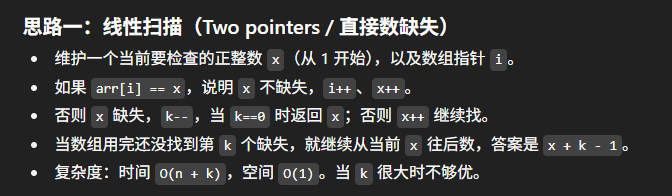

# 1539. Kth Missing Positive Number

## Approach 1: binary search (推荐)

- **题目要求**
  - 找到数组里缺失的第 k 个正整数

- **思路分析**
  - 难点：Binary Search 并不是直接在数组本身上做，而是在一个“miss 数组”上做

- **例子**
  - 数组 `[2,3,4,7,11]`，`k=5`
  - 我们要先计算出每个位置 **在它之前缺失了多少个数**
    - 对于 `arr[i]`，缺失的数量公式是：
      ```
      missed[i] = arr[i] - (i+1)
      ```
    - 解释：
      - 到数字 `arr[i]` 应该有 `arr[i]` 个数
      - 但实际上数组只给了 `(i+1)` 个数
      - 所以缺失了 `arr[i] - (i+1)` 个
  - 代入例子 `[2,3,4,7,11]`
    - 对应的缺失数数组 `missed = [1,1,1,3,6]`


 

```java
// 写法一
class Solution {
    public int findKthPositive(int[] arr, int k) {
        int n = arr.length;
        int left = 0, right = n - 1;

        // 找到第一个 missing(i) >= k 的下标 left
        while (left <= right) {
            int mid = left + (right - left) / 2;
            int missing = arr[mid] - (mid + 1);
            if (missing >= k) {
                right = mid - 1;
            } else {
                left = mid + 1;
            }
        }
        // 此时 left 为第一个 missing(i) >= k 的位置, 即有多少个数是没有miss的；若不存在则 left == n
        return left + k;
    }
}

// 写法二
class Solution {
    public int findKthPositive(int[] arr, int k) {
        int n = arr.length;
        int left = 0, right = n - 1, res = n;

        // 找到第一个 missing(i) >= k 的下标 left
        while (left <= right) {
            int mid = left + (right - left) / 2;
            int missing = arr[mid] - (mid + 1);
            if (missing >= k) {
                res = mid;
                right = mid - 1;
            } else {
                left = mid + 1;
            }
        }
        // 此时 left 为第一个 missing(i) >= k 的位置；若不存在则 left == n
        return res + k;
    }
}

// 写法三
class Solution {
    public int findKthPositive(int[] arr, int k) {
        int n = arr.length;
        int start = 0, end = n - 1;

        // 如果到最后一个元素都没达到k，直接返回
        if (arr[n-1] - n < k) return n + k;

        while (start + 1 < end) {
            int mid = start + (end - start) / 2;
            int missing = arr[mid] - (mid + 1);

            if (missing >= k) {
                end = mid;
            } else {
                start = mid;
            }
        }

        int missingAtStart = arr[start] - (start + 1);
        if (missingAtStart >= k) {
            return start + k;
        } else {
            return end + k;
        }
    }
}

```

## Approach 2: two pointers



- **题目要求**
  - 找到数组里缺失的第 k 个正整数

- **思路来源**
  - 用 **two pointers** 的方式来解决
    - 一个指针 `i`：用来遍历数组里的元素
    - 一个指针 `x`：用来模拟连续递增的自然数（1,2,3,4…）
  - 正常情况下，数组应该是 [1,2,3,4,5,6…]
  - 但是因为中间缺了一些数，所以我们要靠 `x` 来对比

- **方法逻辑**
  - 每一轮，`x` 都会递增
  - 当 `arr[i] == x`
    - 表示没有缺失的数
    - 操作：`i++`，`x++`
  - 当 `arr[i] != x`
    - 表示缺失了一个数
    - 操作：`k--`，因为我们找到了一个缺失的数
    - 如果此时 `k == 0`，说明我们已经找到第 k 个缺失的数，直接返回 `x`
    - 否则继续让 `x++`，接着模拟往后找

- **终止条件**
  - 当数组遍历完了，但 k 还大于 0
    - 说明缺失的数在数组范围之外
    - 结果就是：`x + k - 1`

- **总结**
  - 这个思路的关键是：
    - 用 `i` 遍历数组
    - 用 `x` 模拟完整的递增序列
    - 每次对不上号，就说明缺了一个数 → `k--`
    - 当 `k==0` 时，就找到了答案
  - 简洁高效的 two pointers 解法

```java
class Solution {
    public int findKthPositive(int[] arr, int k) {
        int i = 0, x = 1;
        while (i < arr.length && k > 0) {
            if (arr[i] == x) {
                i++;
            } else {
                k--;
                if (k == 0) return x;
            }
            x++;
        }
        // 数组已用完：继续往后数缺失的 k 个. x + k - 1 是因为 退出循环时 x 已经指向下一个要检查的正整数，而不是最后一个缺失数本身
        return x + k - 1;
    }
}
```