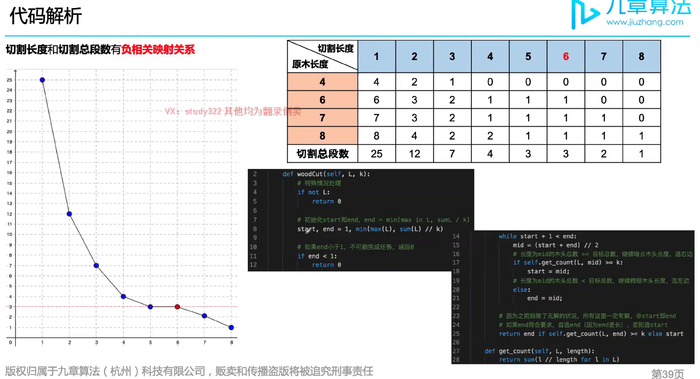

# 1891. Cutting Ribbons



- 思路
    - 先要自己确定一个答案范围再去验证
    -  if (count(ribbons, mid) >= k) start = mid; 这里必须事 >=k, 因为当 count == k时 我们仍然想去看是不是length能更大，比如length = 5， count = k = 3, 但我们需要继续移动start去看length有没有可能更大 比如6 也仍然work

```java
class Solution {
    public int maxLength(int[] ribbons, int k) {
        // 确定可以取的长度范围，start为最小长度，end为最大长度
        int max = Integer.MIN_VALUE;
        for (int num: ribbons) {
            max = Math.max(max, num);
        }

        int start = 1, end = max;
        if (end < 1) return 0;

        // binary search 找到最大长度
        while (start + 1 < end) {
            int mid = start + (end - start)/2;
            if (count(ribbons, mid) >= k) { // 说明每一节的长度还可以更长
                start = mid;
            } else {
                end = mid;
            }
        }

        if (count(ribbons, end) >= k) return end; // 求更长所以先check end
        if (count(ribbons, start) >= k) return start;
        return 0;
    }

    private int count(int[] ribbons, int length) {
        int res = 0;
        for (int num: ribbons) {
            res += num/length;
        }
        return res;
    }
}
```

- time: O(N*log(maxLength))
- space: O(1);