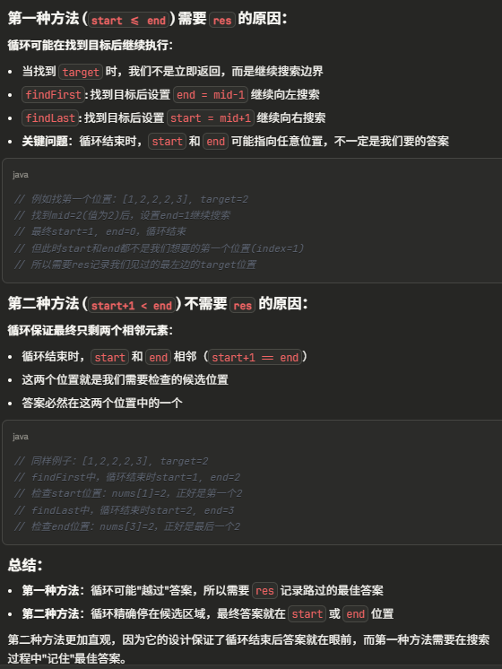

# 34. Find First and Last Position of Element in Sorted Array


## 写法一: start <= end
- 需要res 来记录mid
- first: 找到target 通过 end = mid-1来继续向左找
- last: 找到target, 通过start = mid + 1来继续右找

```java
class Solution {
    public int[] searchRange(int[] nums, int target) {
        if (nums == null || nums.length == 0) return new int[]{-1, -1};
        int first = findFirst(nums, target);
        int last = findLast(nums, target);
        return new int[]{first, last};
    }

    private int findFirst(int[] nums, int target) {
        int start = 0, end = nums.length-1, res = -1;

        while (start <= end) {
            int mid = start + (end-start)/2;
            
            if (nums[mid] < target) {
                start = mid+1;
            } else if (nums[mid] > target) {
                end = mid-1;
            } else {
                res = mid;
                end = mid-1;
            }
        }

        return res;
    }


    private int findLast(int[] nums, int target) {
        int start = 0, end = nums.length-1, res = -1;

        while (start <= end) {
            int mid = start + (end-start)/2;
            
            if (nums[mid] < target) {
                start = mid+1;
            } else if (nums[mid] > target) {
                end = mid-1;
            } else {
                res = mid;
                start = mid+1;
            }
        }

        return res;

    }
}
```

## 写法二
- 不需要res来记录mid

```java
class Solution {
    public int[] searchRange(int[] nums, int target) {
        if (nums == null || nums.length == 0) return new int[]{-1, -1};
        int first = findFirst(nums, target);
        int last = findLast(nums, target);
        return new int[]{first, last};
    }

    private int findFirst(int[] nums, int target) {
        int start = 0, end = nums.length-1;

        while (start+1 < end) {
            int mid = start + (end-start)/2;
            
            if (nums[mid] >= target) {
                end = mid; // 继续往左找
            } else {
                start = mid;
            } 
        }

        if (nums[start] == target) return start;
        if (nums[end] == target) return end;
        return -1;
    }


       private int findLast(int[] nums, int target) {
        int start = 0, end = nums.length-1;

        while (start+1 < end) {
            int mid = start + (end-start)/2;
            
            if (nums[mid] <= target) {
                start = mid; // 继续往右找
            } else {
                end = mid;
            } 
        }

        if (nums[end] == target) return end;
        if (nums[start] == target) return start;
        return -1;
    }
}
```