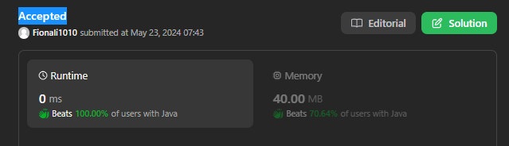

# 374. Guess Number Higher or Lower



- 无重复数
- 有序
- 左闭右开即[left, right)
- while (left <= right) 要使用 <= ，因为left == right是有意义的，所以使用 <=

```java
public class Solution extends GuessGame {
    public int guessNumber(int n) {
        int left = 1;
        int right = n;        

        while (left <= right) {
            int mid = left + (right - left) / 2; //prevent overflow
            int res = guess(mid);

            if (res == -1) {
                right = mid-1;
            } else if (res == 1) {
                left = mid+1;
            } else {
                return mid;
            }
        }
        return -1;    
    }
}

```
- time: O(logN)
- space: O(1)