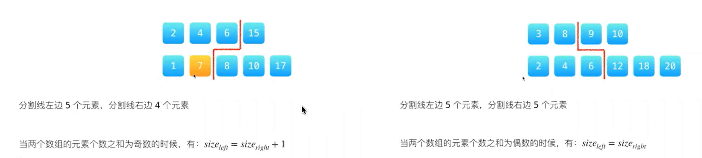
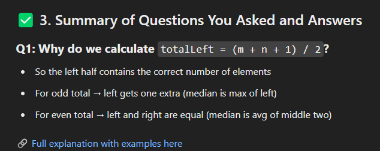
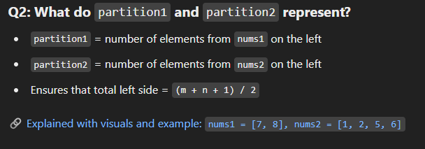
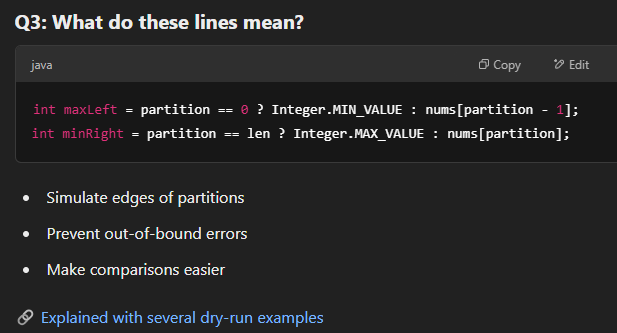
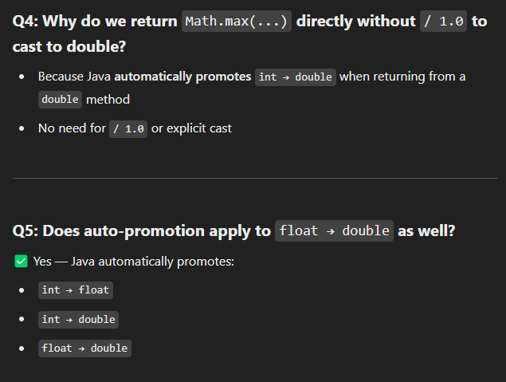

# 4. Median of Two Sorted Arrays

## Appraoch - Binary Search

- **题目要求**
  - 给两个已排序数组 nums1 和 nums2，找到它们的中位数
  - 时间复杂度要求 O(log (m+n))
  - 很明显提示要用 **Binary Search**

- **难点分析**
  - Binary Search 并不是在数值上做，而是在 nums1 (指的是最短的数组) 的**“元素个数”** 上做
  - 我们需要通过划分左右两部分来确定中位数

- **关键思路**
  - 总体思路：把两个数组拼接在一起 → 分成“左半部分”和“右半部分”
    - 左半部分包含较小的元素
    - 右半部分包含较大的元素
  - Median 可以用 **“左半部分的最大值”** 和 **“右半部分的最小值”** 计算
    - 如果总长度是奇数 → 取左半部分的最大值
    - 如果总长度是偶数 → 取 (左半部分最大值 + 右半部分最小值) / 2

- **二分的核心**
  - 永远在 **较短的数组** 上做二分（假设是 nums1）
  - Binary Search 的对象是：**nums1 里“左边的元素个数”**
    - 假设 nums1 左边取了 `partition1` 个
    - 那么 nums2 左边就必须取 `(half - partition1)` 个
    - 其中 `half = (m+n+1)/2`，表示左边元素的总个数，只要知道nums1左边的个数就知道nums2左边要怎么取了

- **划分规则**
  - nums1 被分为：
    - `maxLeft1 = nums1[partition1-1]`
    - `minRight1 = nums1[partition1]`
  - nums2 被分为：
    - `maxLeft2 = nums2[partition2-1]`
    - `minRight2 = nums2[partition2]`
  - 我们需要确保：
    - `maxLeft1 <= minRight2`
    - `maxLeft2 <= minRight1`

- **Binary Search 的移动逻辑**
  - 如果 `maxLeft1 > minRight2` → 说明 nums1 左边取多了 → 往左移
  - 如果 `maxLeft2 > minRight1` → 说明 nums1 左边取少了 → 往右移

- **边界情况**
  - 当划分点在数组的最左边或最右边时，需要特殊处理：
    - 如果某个数组的左半部分为空：
      - `maxLeft = Integer.MIN_VALUE`
    - 如果某个数组的右半部分为空：
      - `minRight = Integer.MAX_VALUE`
  - 这样做的原因：
    - 举例：`nums1 = [1,2,3], nums2 = [5,6,7]`
      - 如果 nums1 全部划到左边，那么它的右边就没数了
      - 此时 `minRight1` 不存在 → 设置为 `Integer.MAX_VALUE`
    - 反过来：`nums1 = [5,6,7], nums2 = [1,2,3]`
      - 如果 nums1 全部划到右边，那么它的左边就没数了
      - 此时 `maxLeft1` 不存在 → 设置为 `Integer.MIN_VALUE`
  - 通过这种边界值，就能保证判断条件依然正确

- **结果计算**
  - 当找到正确划分时：
    - 如果 (m+n) 是奇数
      ```
      median = max(maxLeft1, maxLeft2)
      ```
    - 如果 (m+n) 是偶数
      ```
      median = (max(maxLeft1, maxLeft2) + min(minRight1, minRight2)) / 2
      ```

- **总结**
  - 核心 trick：
    - Binary Search 在 **较短数组的划分点** 上进行
    - 每次通过比较分割后的左右值来调整二分区间
  - 难点在于理解：**二分不是对数值，而是对“元素个数”**
  - 边界情况要用 `Integer.MIN_VALUE` 和 `Integer.MAX_VALUE` 来兜底
  - 一旦划分正确，median 就能直接算出来


### Overall Idea


This problem asks you to find the median of two sorted arrays without merging them.
To do this efficiently (in O(log(min(m, n)) time), you apply binary search on the shorter array, trying to find a partition where:
- All elements in the left half are less than or equal to those in the right half
- The left and right halves are split correctly (based on whether total number of elements is odd or even)
- From this partition, you can directly compute the median.

### Step-by-Step
- Always binary search the shorter array. This ensures the binary search happens on the smaller array, giving you better time complexity and avoiding out-of-bound issues.
- We calculate how many total elements we want in the left half of the partition.
    - numberOfLeftElements = (m + n + 1) / 2;
    - For even total: both halves equal
    - For odd total: left half gets 1 more element
    -  If m+n is odd, median is the max left side number (most left). if m+n is even, median is average of (leftmost + rightmost)/2
- Start binary search on nums1
    - Find partition for nums1 and nums2
        - partition1 = number of elements from nums1 for the left helf
        - partition2 = remaining elements needed from nums2 for the left half
        - 这里的partition 不是index，而是指number of elements
    - Find those 4 elements by partition1 and partition2
        - Here we need to apply bounds checks. Use Integer.MIN_VALUE and Integer.MAX_VALUE when the partition is at array boundaries to avoid index errors
    - Check for valid partition: 
        - if (maxLeftFromNums1 <= minRightFromNums2 && maxLeftFromNums2 <= minRightFromNums1)
        - If valid, we’ve found the correct partition.
            - For even total elements, return the average of the two middle numbers
            - For odd total elements, return the max of the left side
    - Adjust partition for nums1 if not valid
        - If left side of nums1 is too big → shrink partition (move left)
        - If left side of nums1 is too small → increase partition (move right)
    - Default return (never hit unless input is invalid)

```java
class Solution {
    public double findMedianSortedArrays(int[] nums1, int[] nums2) {
        // quick check to ensure we search on the shorter array
        if (nums1.length > nums2.length) return findMedianSortedArrays(nums2, nums1);

        // logic to find median: 
            // if m+n is odd, median is the max left side number (most left)
                // so we want left side to have one more element than the right side
            // if m+n is even, median is average of (leftmost + rightmost)/2
                // so both sides have same number of elements
        int m = nums1.length;
        int n = nums2.length;
        int numberOfLeftElements = (m+n+1)/2;
        
        int left = 0, right = m;
        while (left <= right) {
            int partition1 = left + (right-left)/2; //partition for nums1, number of elements we need for leftside from nums1
            int partition2 = numberOfLeftElements - partition1; //partition for nums2, number of elements we need for leftside from nums2

            int maxLeftFromNums1 = partition1 == 0? Integer.MIN_VALUE: nums1[partition1-1];
            int minRightFromNums1 = partition1 == m? Integer.MAX_VALUE: nums1[partition1];

            int maxLeftFromNums2 = partition2 == 0? Integer.MIN_VALUE: nums2[partition2-1];
            int minRightFromNums2 = partition2 == n? Integer.MAX_VALUE: nums2[partition2];

            // implement binary search
            if (maxLeftFromNums1 <= minRightFromNums2 && maxLeftFromNums2 <= minRightFromNums1) { // valid
                if ((m+n) % 2 == 0) {
                    return (Math.max(maxLeftFromNums1,maxLeftFromNums2) + Math.min(minRightFromNums1, minRightFromNums2)) / 2.0;
                } else {
                    return Math.max(maxLeftFromNums1,maxLeftFromNums2);
                }
            } else if (maxLeftFromNums1 > minRightFromNums2) { // not valid
                right = partition1 - 1;
            } else { // not valid - when maxLeftFromNums2 > minRightFromNums1
                left = partition1 + 1;
            }
        }
        return 0.0;
    }
}
```

### Some questions




