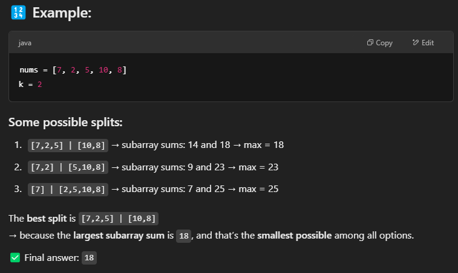
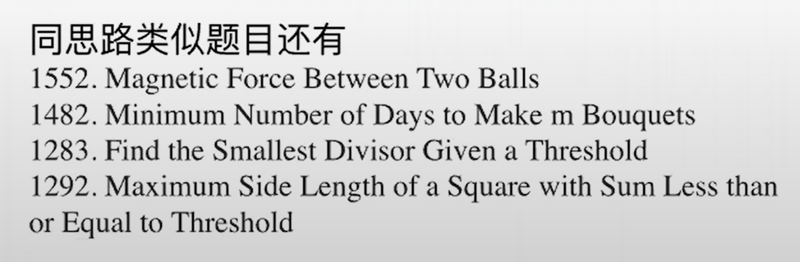
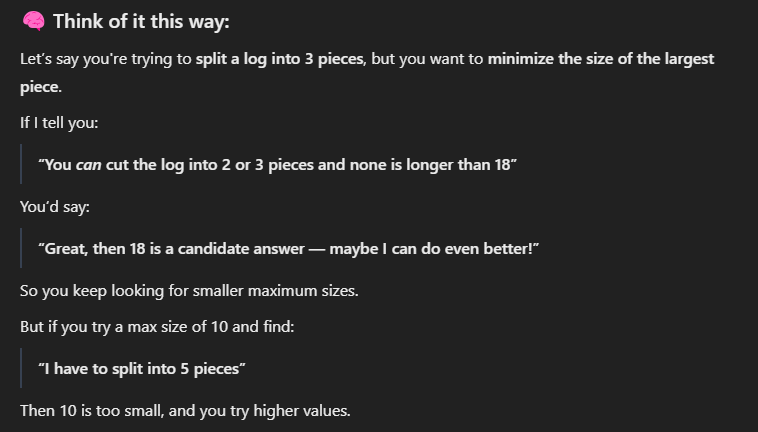

# 410. Split Array Largest Sum





## Approach - prefix sum + binary search



- Low and high
    - low: max(nums), 如果k = nums.length, 每一个数就是一节
    - high: sum(nums)， 如果 k = 1, 答案就是sum(nums)
    - 正确答案一定是between low and high 


### Implementaiion 1
```java
class Solution {
    public int splitArray(int[] nums, int k) {
        // int low = Arrays.stream(nums).max().getAsInt();
        // int high = Arrays.stream(nums).sum();
        int low = 0, high = 0;

        for (int num : nums) {
            low = Math.max(low, num);  
            high += num;              
        }
        return binarySearch(nums, k, low, high);
    }

    private int binarySearch(int[] nums, int k, int low, int high) {
        while (low <= high) {
            int mid = low + (high-low)/2;
            if (valid(nums, k, mid)) {
                high = mid-1;
            } else {
                low = mid+1;
            }
        }
        return low;
    }

    private boolean valid(int[] nums, int k, int maxSubarraySum) {
        int count = 1, curSum = 0;

        for (int num: nums) {
            curSum += num;
            if (curSum > maxSubarraySum) {
                curSum = num;
                count++;
                if (count > k) return false;
            }
        }
        return true;
    }
}
```

### Implementaiion 2

```java
class Solution {
    public int splitArray(int[] nums, int k) {
        int low = 0, high = 0;

        // Step 1: Determine initial search range
        for (int num : nums) {
            low = Math.max(low, num);  // max single element
            high += num;               // sum of all elements
        }

        // Step 2: Binary search
        while (low < high) {
            int mid = low + (high - low) / 2;

            if (canSplit(nums, k, mid)) {
                high = mid;  // try smaller max sum
            } else {
                low = mid + 1;  // increase max sum
            }
        }

        return low; // or high — they are equal at this point
    }

    // Helper function: can we split into ≤ k subarrays with max sum ≤ target?
    private boolean canSplit(int[] nums, int k, int maxSumAllowed) {
        int count = 1;  // we always have at least 1 subarray
        int currentSum = 0;

        for (int num : nums) {
            if (currentSum + num > maxSumAllowed) {
                count++;  // start a new subarray
                currentSum = num;

                if (count > k) return false; // too many subarrays
            } else {
                currentSum += num;
            }
        }

        return true;
    }
}
```