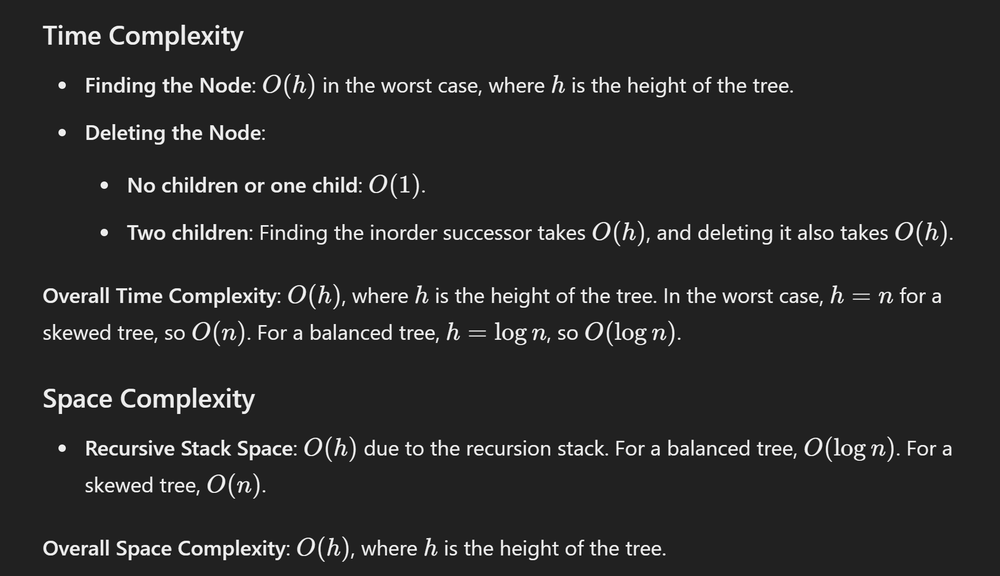

# 450. Delete Node in a BST

## Approach 1 - recursion

```java
/**
 * Definition for a binary tree node.
 * public class TreeNode {
 *     int val;
 *     TreeNode left;
 *     TreeNode right;
 *     TreeNode() {}
 *     TreeNode(int val) { this.val = val; }
 *     TreeNode(int val, TreeNode left, TreeNode right) {
 *         this.val = val;
 *         this.left = left;
 *         this.right = right;
 *     }
 * }
 */
class Solution {
    public TreeNode deleteNode(TreeNode root, int key) {
        if (root == null) {
            return null;
        }

        if (key > root.val) {
            // here root.right is direction, means root's right side points to which node
            root.right = deleteNode(root.right, key); // this is also assining the updated subtree to root.right
        } else if (key < root.val) {
            root.left = deleteNode(root.left, key);
        } else {
            if (root.left == null) {
                return root.right; //if root.right == null as well, np, we can still return it
            } else if (root.right == null) {
                return root.left;
            }

            // if root has both left and right subtree
            TreeNode min = minValNode(root.right);
            root.val = min.val;
            root.right = deleteNode(root.right, root.val);
        }
        return root;
    }

// min value node is root step right, then go left until reach the end
    public TreeNode minValNode(TreeNode root) {
        if (root == null) {
            return null;
        }
        TreeNode cur = root;
        while (cur.left != null) {
            cur = cur.left;
        }
        return cur;
    }
}

```

