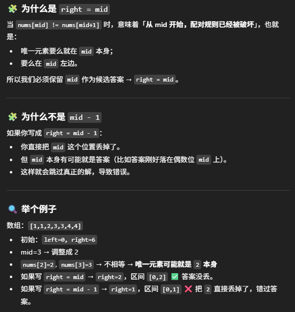

# 540. Single Element in a Sorted Array

- **题目要求**
  - 给定一个 sorted 数组，只有一个元素是 single，其他元素都出现两次
  - 要求在 **O(log n)** 的时间内找到这个 single element
  - 很明显 → 需要用 **Binary Search**

- **难点分析**
  - 常规的二分法通常需要一个 target
  - 但是这题没有 target，你无法直接和一个数去比较
  - 关键问题：**Binary Search 是在什么上面做的？**
    - 答案：**不是在数值上，而是在 index 上**

- **核心规律**
  - 在 single element 出现之前：
    - **偶数 index 上的数字** 都应该等于它后面那个数字
  - 在 single element 出现之后：
    - **偶数 index 上的数字** 不再等于它后面那个数字
  - 所以我们可以通过这个规律来决定指针移动方向

- **具体思路**
  - 初始化：`left = 0`，`right = nums.length - 1`
  - 循环条件：`while (left < right)`
  - 每次取 `mid`，并确保它是偶数
    - 如果 `mid` 是奇数 → `mid--`，保证是偶数
  - 判断：
    - 如果 `nums[mid] == nums[mid+1]`
      - 说明 single element 还没出现
      - 移动左指针：`left = mid + 2`
    - 否则
      - 说明 single element 在左边（包括 mid）
      - 移动右指针：`right = mid`
  - 循环结束后，`left == right`，此时就是答案

- **注意事项**
  - `left < right`，不能写 `<=`，否则会越界
  - `mid` 必须保证是偶数，否则规律不成立
  - `left` 移动要跨两步 (`mid+2`)，否则会超时
  - `right = mid`，而不是 `mid+1`，否则可能错过答案
  - 最终返回的是 `nums[left]`（此时 `left == right`）

- **总结**
  - 核心：Binary Search 在 **index 上** 做，而不是数值上
  - 通过“偶数 index 和后一个数的关系”来判断单个元素的位置
  - 有很多细节需要注意，必须小心处理边界和移动规则
  - 可以用 `[5,6,6,8,8]` 或 `[6,6,8,8,9]` 这样的数组来手动验证


```java
class Solution {
    public int singleNonDuplicate(int[] nums) {
        int left = 0, right = nums.length-1; //不能用 right = nums.length, 会越界, 表示区间里至少有两个元素

        while (left < right) { // left <= right会越界
            int mid = left + (right - left)/2;
            if (mid % 2 == 1) mid--; // 保证mid是偶数

            if (nums[mid] == nums[mid+1]) {
                left = mid + 2; // 左边配对正常，答案在右边， / left == mid会超时
            } else {
                right = mid; // 配对出错，答案在左边（含 mid， right == mid-1会丢掉答案）
            }
        }
        return nums[left]; //此时left == right 
    }
}

// 写法二
class Solution {
    public int singleNonDuplicate(int[] nums) {
        int left = 0, right = nums.length - 1;
        
        while (left + 1 < right) {
            int mid = left + (right - left) / 2;
            if (mid % 2 == 1) mid--;
            
            if (nums[mid] == nums[mid + 1]) {
                left = mid + 2; // left == mid会超时
            } else {
                right = mid; // right == mid-1会丢掉答案，mid我们已经确保是偶数位，而答案一定会出现在偶数index
            }
        }

        // 退出时 left 和 right 只差 0 或 1，需要手动判断
        if (left == right) return nums[left];
        return nums[left] == nums[left+1] ? nums[right] : nums[left];
    }
}
```

