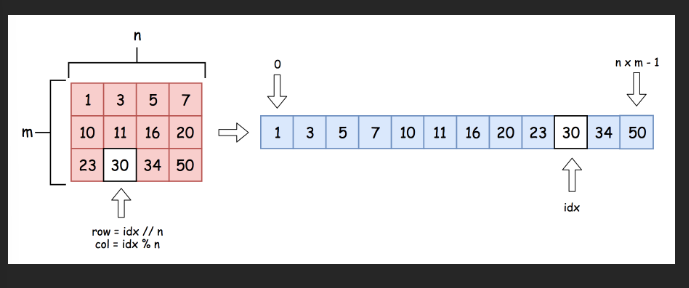

# 74.Search a 2D Matrix

## Approach - binary search

这一题很简单，主要是把matrix和index如何转换想通
    - 把坐标转化成index： x * cols + y
    - 把index转化成坐标
        - row = idx / n
        - col = idx % n;


```java
class Solution {
    public boolean searchMatrix(int[][] matrix, int target) {
        int m = matrix.length;
        int n = matrix[0].length;
        int left = 0, right = m * n - 1;

        while (left <= right) {
            int mid = left + (right-left)/2;
            int row = mid / n;
            int col = mid % n;
            int num = matrix[row][col];
            
            if (num > target) {
                right = mid-1;
            } else if (num < target) {
                left = mid+1;
            } else {
                return true;
            }
        }
        return false;
    }
}
```