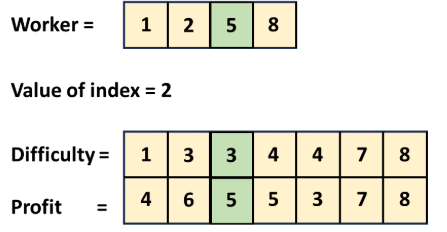

# 826. Most Profit Assigning Work

## Approach 1 - sorting + Greedy + two pointers


```java
class Solution {
    public int maxProfitAssignment(int[] difficulty, int[] profit, int[] worker) {
        int n = difficulty.length;
        int[][] jobs = new int[n][2];

        // create pairs: [difficulty, profit]
        for (int i = 0; i < n; i++) {
            jobs[i][0] = difficulty[i];
            jobs[i][1] = profit[i];
        }

        // sort jobs by difficulty
        Arrays.sort(jobs, (a, b) -> a[0] - b[0]);

        // sort workers by ability
        Arrays.sort(worker);

        int res = 0;
        int bestProfitSoFar = 0; // 这里一定要define在外面 比如一些diffculty低的工作有可能钱更多 这时候我们就应该比较当下这个difficulty 和 bestProfitSoFar
        int j = 0;  // job pointer
        
        // for each worker from weakest to strongest
        for (int w : worker) {
            while (j < n && jobs[j][0] <= w) {
                bestProfitSoFar = Math.max(bestProfitSoFar, jobs[j][1]);
                j++;
            }
            res += bestProfitSoFar;
        }

        return res;
    }
}
```

## Approach 2 - 