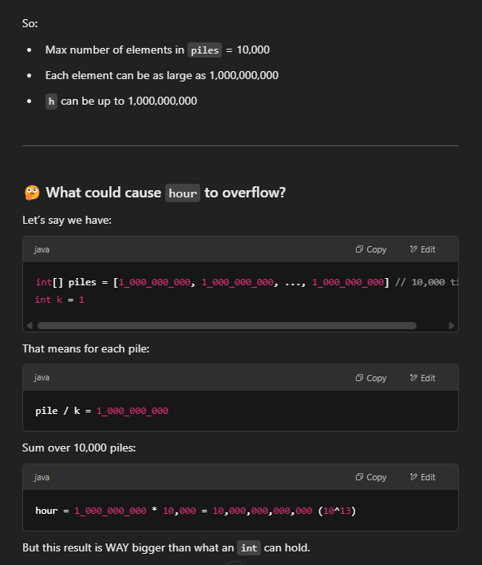

# 875. Koko Eating Bananas


## 写法一: binary search + valid 判断 (推荐)

- 这种猜数字的题是不需要排序的，why?
    - 题目没有给出数字范围，需要我们自己去构建或根据题目理解出数字的范围
        - 比如这道题，low = 1, high = max(piles)
        - low只能是1，不能是数组中最小数，或数组平均数，因为当h 很大时，最小答案完全可以是1，比如[2,4,4], h = 10, 如果low = 2, 这道题就错了
        -  high = max(sum): h 肯定大于等于piles.length, 不然题目没法做 => k(speed) 一定是介于 1~max(piles); 因为max一定work
        - 答案介于 1~max之间，这里运用binary search, 判断是否valid来调整边界，相当于binary search再有序的数组中进行了
    - Will hour overflow if piles are large?
        - hour += pile % k == 0 ? pile / k : pile / k + 1;
        - Yes, hour can potentially overflow if the piles are very large — especially near the problem's upper bounds. We can use long for hour to avoid overflow but seems working with int with this solution
        - Java int max value = 2,147,483,647 (≈ 2 * 10⁹)

```java
class Solution {
    public int minEatingSpeed(int[] piles, int h) {
        int left = 1, right = Arrays.stream(piles).max().getAsInt();
        int res = 0;
        
        int res = 0;
        while (left <= right) {
            int k = left + (right-left)/2;

            if (valid(piles, k, h)) {
                res = k; // use a res variable here
                right = k-1;
            } else {
                left = k+1;
            }
        } 
        return res;
    }

    private boolean valid(int[] piles, int k, int h) {
        long hour = 0; // use long otherwise overflow
        for (int pile: piles) {
            hour += pile % k == 0? pile/k: pile/k+1;
        }
        return hour <= h;
    }
}
```


```java
class Solution {
    public int minEatingSpeed(int[] piles, int h) {
        int right = 0, left = 1;
        for (int pile: piles) {
            right = Math.max(right, pile);
        }
        
        while (left < right) {
            int k = left + (right-left)/2;

            if (valid(piles, k, h)) {
                right = k;
            } else {
                left = k+1;
            }
        } 
        return left;
    }

    private boolean valid(int[] piles, int k, int h) {
        long hour = 0;
        for (int pile: piles) {
            hour += pile % k == 0? pile/k: pile/k+1;
        }
        return hour <= h;
    }
}
```


```java
class Solution {
    public int minEatingSpeed(int[] piles, int h) {
        int right = 0, left = 1;
        for (int pile: piles) {
            right = Math.max(right, pile);
        }
        
        while (left + 1 < right) {
            int k = left + (right-left)/2;

            if (valid(piles, k, h)) {
                right = k;
            } else {
                left = k;
            }
        } 
        
        if (valid(piles, left, h)) {
            return left; // check left first becuase it is smaller then right, we are looking for minimum value
        }
        return right;
    }

    private boolean valid(int[] piles, int k, int h) {
        long hour = 0;
        for (int pile: piles) {
            hour += pile % k == 0? pile/k: pile/k+1;
        }
        return hour <= h;
    }
}


```


## 写法二 (推荐 比较简洁而且好理解)
- h 肯定大于等于piles.length, 不然题目没法做；
- k(speed) 一定是介于 1~max(piles); 因为max一定work
- 用binary search 从1 ~ max之间找到合适的；
- 没找到一个解，还要继续，因为有可能不是最小的
- hours 要定义成long, 不然有的case会overflow; 或者用Math.ceil((Double)p/k), 前面只能是double, 但是double很慢

```java
class Solution {
    public int minEatingSpeed(int[] piles, int h) {
        
        int left = 1;
        int right = Arrays.stream(piles).max().getAsInt(); // Find the max value in piles
        int res = right; // we know for sure this must work;

        while (left <= right) {
            int k = left + (right-left)/2;
            long hours = 0; // Use long to prevent overflow
            for(int p: piles) {
                int curh = p % k == 0? p/k: p/k+1;
                hours += curh; 
            }

           if (hours <= h) {
                res = k;
                right = k-1;
            } else {
                left = k+1;
            }
        }
        return res;
    }
}

```

- time O(logm * N)
    - 外层 logm, m为max pile
    - 内存 O(n) 
    - logm次 o(n)
- space O(1)