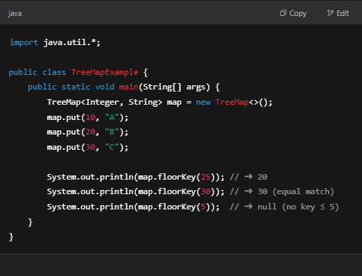
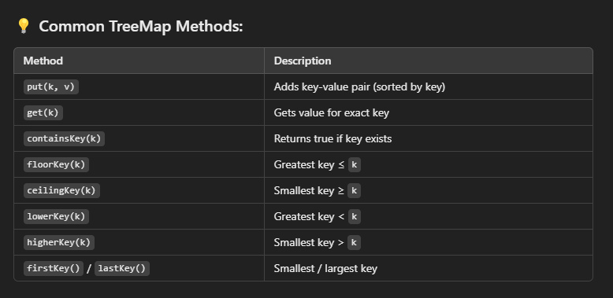

# 981. Time Based Key-Value Store

## Approach 1 - TreeMap

- Create a HashMap where:
    - The key is a String (like "foo")
    - The value is a TreeMap<Integer, String> — timestamps mapped to values
- Set: For a given key, insert a (timestamp, value) pair into its TreeMap
    - If the key doesn't exist, create a new TreeMap first
    - TreeMap ensures that timestamps are stored in sorted order
- Get: Check if the key exists
    - Use floorKey(timestamp) to find the largest timestamp ≤ input, This is exactly what we want per problem statement
    - If no such timestamp exists, return "", Otherwise return the corresponding value

```java
class TimeMap {
    HashMap<String, TreeMap<Integer, String>> map;
    public TimeMap() {
        map = new HashMap<>();
    }
    
    public void set(String key, String value, int timestamp) {
        map.putIfAbsent(key, new TreeMap<>());
        map.get(key).put(timestamp, value);
    }
    
    public String get(String key, int timestamp) {
        if (!map.containsKey(key)) return "";
        TreeMap<Integer, String> tree = map.get(key);
        Integer t = tree.floorKey(timestamp); // treeMap floorKey method returns Integer not int, as it can also return null, but int cannot be null， floorkey means <= timestamp 最接近的树
        return t == null? "": tree.get(t);
    }
}
```

- time: O(1)
- Space: O(N)




## TreeMap

A map that stores key-value pairs in sorted order of the keys. It’s implemented as a Red-Black Tree, so:
- Keys are always kept in sorted (natural or custom) order
- All major operations (put, get, remove, etc.) take O(log n) time

### Common Use-Cases:
- You want ordered keys
- You want to search for closest smaller/larger key (e.g., floor/ceiling)
- You want range queries (e.g., keys between A and B)




## Approach 2 - implemented binary search
```java
class TimeMap {
    Map<String, ArrayList<Pair>> map;

    public TimeMap() {
        map = new HashMap<>();
    }
    
    public void set(String key, String value, int timestamp) {
        map.putIfAbsent(key, new ArrayList<>());
        map.get(key).add(new Pair(timestamp, value));
    }
    
    public String get(String key, int timestamp) {
        if (!map.containsKey(key)) return "";
        List<Pair> list = map.get(key);
        int left = 0, right = list.size()-1;
        String res = "";

        while (left <= right) {
            int mid = left + (right-left)/2;
            Pair pair = list.get(mid);

            if (pair.timestamp <= timestamp) {
                res = pair.value;
                left = mid+1;
            } else if (pair.timestamp > timestamp) {
                right = mid-1;
            } 
        }
        return res;
    }

    private class Pair {
        int timestamp;
        String value;
        
        Pair (int timestamp, String value) {
            this.timestamp = timestamp;
            this.value = value;
        }
    }
}

/**
 * Your TimeMap object will be instantiated and called as such:
 * TimeMap obj = new TimeMap();
 * obj.set(key,value,timestamp);
 * String param_2 = obj.get(key,timestamp);
 */

```

```java
class Pair {
    int timestamp;
    String value;

    Pair(int timestamp, String value) {
        this.timestamp = timestamp;
        this.value = value;
    }
}
class TimeMap {
    Map<String, List<Pair>> map;

    public TimeMap() {
        map = new HashMap<>();
    }
    
    public void set(String key, String value, int timestamp) {
        map.putIfAbsent(key, new ArrayList<>());
        map.get(key).add(new Pair(timestamp, value));
    }
    
    public String get(String key, int timestamp) {
        if (!map.containsKey(key)) return "";
        List<Pair> list = map.get(key);
        int left = 0, right = list.size()-1;

        while (left + 1 < right) {
            int mid = left + (right-left)/2;
            Pair pair = list.get(mid);
            
            if (pair.timestamp <= timestamp) {
                left = mid+1;
            } else {
                right = mid-1;
            }
        }
        // Always check right first because it's the higher candidate.
        if (list.get(right).timestamp <= timestamp) {
            return list.get(right).value;
        }
        if (list.get(left).timestamp <= timestamp) {
            return list.get(left).value;
        }
        return "";
    }
}


```