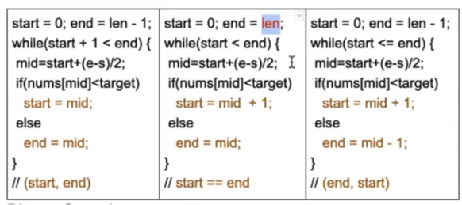

# Binary Search 



## Version 1
```java
// non-recursion
public static int binarySearch2(int[] nums, int target) {
        int left = 0, right = nums.length-1;

        while (left <= right) {
            int mid = left + (right - left)/2;
            if (nums[mid] > target) {
                right = mid+1;
            } else if (nums[mid] < target ) {
                left = mid - 1;
            } else {
                return mid;
            }
        }
        return -1;
    }

// recursion
public static int binarySearch2(int[] nums, target) {
     public static int binarySearch3(int[] nums, int start, int end, int target) {
        int mid = start + (end - start)/2;

        if (start > end) {
            return -1;
        }

        if (nums[mid] > target) {
            return binarySearch3(nums, start, mid-1, target);
        }

        if (nums[mid] < target) {
            return binarySearch3(nums, mid+1, end, target);
        }

        return mid;
    }
}
```

## Version 2
```java
public static int binarySearch1(int[] nums, int target) {
        int left = 0, right = nums.length;

        while (left < right) {
            int mid = left + (right - left)/2;
            if (nums[mid] > target) {
                right = mid;
            } else if (nums[mid] < target ) {
                left = mid + 1;
            } else {
                return mid;
            }
        }
        return -1;
    }
```

## version 3
- 用于解决数组中有重复数字

```java
    public static int binarySearch(int[] nums, int target) {
        if (nums == null || nums.length == 0) {
            return -1;
        }

        int start = 0, end = nums.length-1;
        while (start + 1 < end) {
            int mid = start + (end - start)/2;
            if (nums[mid] == target) {
                start = mid;
            } else if (nums[mid] < target) {
                start = mid+1;
            } else {
                end = mid - 1;
            }
        }

        // 如果要求返还的时第一个出现的target，则把下一行和这一行对调
        if (nums[end] == target) {
            return end;
        }

        if (nums[start] == target) {
            return start;
        }

        return -1;
    }
```