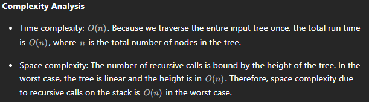

# 101. Symmetric Tree

## Approach 1 - recusion preoder DFS

```java
class Solution {
    public boolean isSymmetric(TreeNode root) {
        if (root == null) {
            return true;
        }
        
        return preorder(root.left, root.right);
    }

    public boolean preorder(TreeNode node1, TreeNode node2) {
        if (node1 == null && node2 == null) return true;
        if (node1 == null || node2 == null) return false;
           
        return node1.val != node2.val && preorder(node1.left, node2.right) 
                && preorder(node1.right, node2.left);
    }
}

```


## Approach 2 - interation


```java
class Solution {
    public boolean isSymmetric(TreeNode root) {
        if (root == null) return true;
        
        Queue<TreeNode> que = new LinkedList<>();
        que.add(root.left);
        que.add(root.right);

        while (!que.isEmpty()) {
            TreeNode n1 = que.poll(); //left subtree;
            TreeNode n2 = que.poll(); //right subtree;
            
            if (n1 == null && n2 == null) continue; // here dont return true, because we need to keep checking if there are other pairs in the que;
            if (n1 == null || n2 == null) return false;
            if (n1.val != n2.val) return false;

            que.add(n1.left);
            que.add(n2.right);
            que.add(n1.right);
            que.add(n2.left);
        }
        return true;
    }
}

```