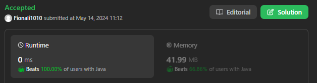

# 103. Binary Tree Zigzag Level Order

## Approach 1 



```java
class Solution {
    public List<List<Integer>> zigzagLevelOrder(TreeNode root) {
        List<List<Integer>> lists = new ArrayList<>(); // return;
        Queue<TreeNode> que = new LinkedList<>();
        boolean isLeftToRight = true;

        if (root == null) return lists;

        que.add(root);

        while (!que.isEmpty()) {
            List<Integer> list = new ArrayList<>();
            int size = que.size();

            for (int i = 0; i < size; i++) {
                TreeNode node = que.poll();
                list.add(node.val);

                if (node.left != null) {
                    que.add(node.left);
                }

                if (node.right != null) {
                    que.add(node.right);
                }
            }

            if (!isLeftToRight) {
                Collections.reverse(list);
            }

            lists.add(list);
            isLeftToRight = !isLeftToRight;
        }

        return lists;
    }
}
```

- The time complexity of this solution is O(n), where n is the number of nodes in the binary tree. This is because the algorithm visits each node exactly once, performing constant-time operations (such as adding and removing nodes from the queue) for each node.
- The space complexity of this solution is also O(n), where n is the number of nodes in the binary tree. This is because the algorithm uses a queue to perform a level-order traversal, and in the worst-case scenario, the queue can contain all nodes at the lowest level of the tree, which is approximately n/2 nodes. Additionally, the algorithm uses a list to store the result, which can also contain up to n nodes in the worst case.