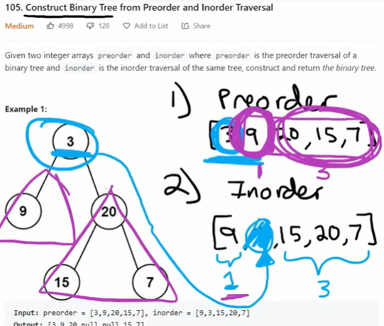

# 105. Construct Binary Tree from Preorder and Inorder Traveral

## Approach 1

[tutorial](https://www.youtube.com/watch?v=ihj4IQGZ2zc&t=263s);

We are given preorder and inorder array of the binary tree (all nodes have unique value). We have enough information to rebuild the tree. We just need to figure out how to destruct the information from those two arrays.

1. always take the first node in preroder as the root or the root of the subtree
2. find the root in preorder array, look up that node in the inorder array
    - nodes before the root node in inorder should go to the left subtree
    - nodes after the root node in inorder should go to the the subtree
    - based on the number of nodes go to the left/right subtree, we partition the preprder array
3. recursively build the left subtree and right subtree:
    - preorder: [3,9,20,15,7] - 用于找root
    - inorder: [9,3,15,20,7] - 用于确认how to partition
        - preorder[0] 一定是root, so 确认3 is root
        - preorder[0] = 3, 3在inorder里面为 inorder[1], inorder[1] 之前的数全部是 root left subtree
        - inorder[1] 后面的数全部是 root right subtree, 重复这个步骤
        - inorder: 9 (before 3) belongs to left subtree, 15,20,7 (after 3) belong to the right subtree
        - partition and build the tree
4. Java for array does not have indexOf method, we have to write a helper function for this.



```java
 class Solution {
    public TreeNode buildTree(int[] preorder, int[] inorder) {
        if (preorder.length == 0 && inorder.length == 0) {
            return null;
        }

        TreeNode root = new TreeNode(preorder[0]);
        int mid = findIndex(inorder, preorder[0]);
        root.left = buildTree(Arrays.copyOfRange(preorder, 1, mid+1), Arrays.copyOfRange(inorder, 0, mid));
        root.right = buildTree(Arrays.copyOfRange(preorder, mid+1, preorder.length), Arrays.copyOfRange(inorder, mid+1, inorder.length));

        return root;
    }

    public int findIndex(int[] nums, int k) {
        for (int i = 0; i < nums.length; i++) {
            if (nums[i] == k) {
                return i;
            }
        }
        return -1;
    }
}
```

## Appraoch 2 - imporved version


- Here we only use inorder to tell if it is out of bound and should return null;
- we use preorder to get the root by using a index, so we dont have to copy range; 
- l and right have to be within the array range that's my we use mid-1 and mid+1;

```java
class Solution {
    HashMap<Integer, Integer> map = new HashMap<>();
    int preInx = 0;

    public TreeNode buildTree(int[] preorder, int[] inorder) {
        if (preorder.length == 0 || inorder.length == 0) {
            return null;
        }

        for (int i = 0; i < inorder.length; i++) {
            map.put(inorder[i], i);
        } 

        return builder(0, inorder.length-1, inorder, preorder);
    }
    
    public TreeNode builder(int l, int r, int[] inorder, int[] preorder) {
        if (l > r) {
            return null;
        }

        TreeNode root = new TreeNode(preorder[preInx++]);
        int mid = map.get(root.val);

        root.left = builder(l, mid-1, inorder, preorder);
        root.right = builder(mid+1, r, inorder, preorder);

        return root;
    }
}
```
- Time and space analyze:
  - Time Complexity: The algorithm runs in O(n) time, where n is the number of nodes in the tree. This is because each node is processed exactly once.
  - Space Complexity: The space complexity is O(n) due to the hashmap storing the inorder indices and the recursive call stack, which can go up to O(n) in the worst case (skewed tree).