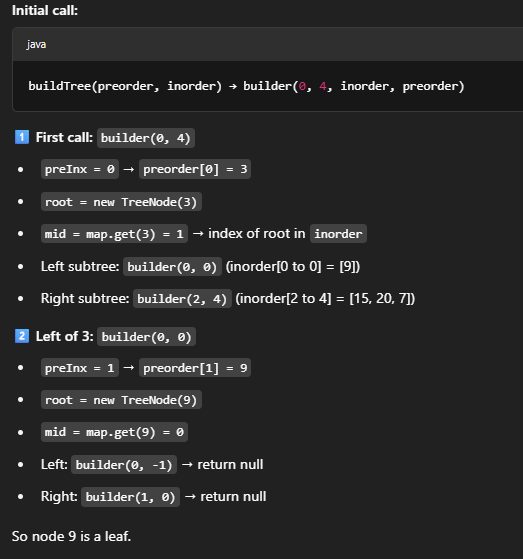

# 105. Construct Binary Tree from Preorder and Inorder Traveral

## Approach 1 (easy to understand, but quite slow)

[tutorial](https://www.youtube.com/watch?v=ihj4IQGZ2zc&t=263s);

We are given preorder and inorder array of the binary tree (all nodes have unique value). We have enough information to rebuild the tree. We just need to figure out how to destruct the information from those two arrays.

1. always take the first node in preroder as the root or the root of the subtree
2. find the root in preorder array, look up that root node in the inorder array
    - inorder array: nodes before the root node in inorder should go to the left subtree
    - inorder array: nodes after the root node in inorder should go to the the subtree
    - based on the number of nodes go to the left/right subtree, we partition the preprder array
3. recursively build the left subtree and right subtree:
    - preorder: [3,9,20,15,7] - 用于找root
    - inorder: [9,3,15,20,7] - 用于确认how to partition
        - preorder[0] 一定是root, so 确认3 is root
        - preorder[0] = 3, 3在inorder里面为 inorder[1], inorder[1] 之前的数全部是 root left subtree
        - inorder[1] 后面的数全部是 root right subtree, 重复这个步骤
        - inorder: 9 (before 3) belongs to left subtree, 15,20,7 (after 3) belong to the right subtree
        - partition and build the tree
        - if (preorder.length == 0 || inorder.length == 0) return null;
            - 这个是base case或者是recursion 终止条件，当preorder or inorder length == 0, 表示已经处理完了最底层的叶子节点，不用再继续了 
4. Java for array does not have indexOf method, we have to write a helper function for this.


```java
class Solution {
    public TreeNode buildTree(int[] preorder, int[] inorder) {
        if (preorder.length == 0 || inorder.length == 0) return null; 

        TreeNode root = new TreeNode(preorder[0]);
        int mid = findIndex(inorder, preorder[0]);
        
        int[] leftPreorder = Arrays.copyOfRange(preorder, 1, mid+1);
        int[] leftInorder = Arrays.copyOfRange(inorder, 0, mid);
        root.left = buildTree(leftPreorder, leftInorder);

        int[] rightPreorder = Arrays.copyOfRange(preorder, mid+1, preorder.length);
        int[] rightInorder = Arrays.copyOfRange(inorder, mid+1, inorder.length);
        root.right = buildTree(rightPreorder, rightInorder);

        return root;
    }

    private int findIndex (int[] inorder, int num) {
        for (int i = 0; i < inorder.length; i++) {
            if (inorder[i] == num) {
                return i;
            }
        }
        return -1;
    }
}
```


## Appraoch 2 - imporved version (recommended, much faster)


- Using map to find mid, so we dont need to go through inorder array each time to find mid
- Here we only use inorder to tell if it is out of bound and should return null;
    - In each recursive call, start and end are the indices of the inorder array for the current subtree. 
    - This allows us to identify the current subtree’s range in inorder.
- we use preorder and preInx to get the root by using a index, so we dont have to copy range; 
- start and end have to be within the array range that's my we use mid-1 and mid+1;

```java
class Solution {
    HashMap<Integer, Integer> map = new HashMap<>();
    int preIdx = 0;

    public TreeNode buildTree(int[] preorder, int[] inorder) {
        for (int i = 0; i < inorder.length; i++) {
            map.put(inorder[i], i);
        }

        return builder(0, inorder.length-1, preorder, inorder);
    }

    private TreeNode builder(int start, int end, int[] preorder, int[] inorder) {
        if (start > end) return null;

        TreeNode root = new TreeNode(preorder[preIdx++]);
        int mid = map.get(root.val);
        root.left = builder(start, mid-1, preorder, inorder);
        root.right = builder(mid+1, end, preorder, inorder);

        return root;
    }
}
```
- Time and space analyze:
  - Time Complexity: The algorithm runs in O(n) time, where n is the number of nodes in the tree. This is because each node is processed exactly once.
  - Space Complexity: The space complexity is O(n) due to the hashmap storing the inorder indices and the recursive call stack, which can go up to O(n) in the worst case (skewed tree).

- example run
    - preorder = [3, 9, 20, 15, 7]
    - inorder  = [9, 3, 15, 20, 7]

