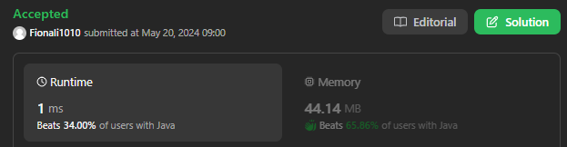
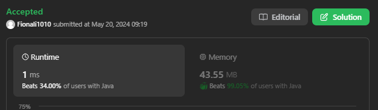

# 110. Balanced Binary Tree

## Approach 1 - divide and conquer



- balanced 的两个条件：
  - 左子树和右子树同时balanced;
  - 左子树减右子树高度只差绝对值  < 1;
  
```java
final class Result {
    public boolean balanced;
    public int height;
    public Result(int height, boolean balanced) {
        this.height = height;
        this.balanced = balanced;
    }
}

class Solution {
    public boolean isBalanced(TreeNode root) {
        Result res = dfs(root);
        return res.balanced;
    }

    public Result dfs(TreeNode root) {
        if (root == null) {
            return new Result(0, true);
        }

        Result leftRes = dfs(root.left);
        Result rightRes = dfs(root.right);

        int height = Math.max(leftRes.height, rightRes.height) + 1;
        boolean balanced = true;

        if (!leftRes.balanced || !rightRes.balanced) {
            balanced = false;
        }

        if (Math.abs(leftRes.height - rightRes.height) > 1) {
            balanced = false;
        }

        return new Result(height, balanced);
    }
}
```

## Approach 2 - divide and conquer



```java
class Solution {
    // Recursively obtain the height of a tree. An empty tree has -1 height
    private int height(TreeNode root) {
        // An empty tree has height -1
        if (root == null) {
            return 0;
        }
        return 1 + Math.max(height(root.left), height(root.right));
    }

    public boolean isBalanced(TreeNode root) {
        // An empty tree satisfies the definition of a balanced tree
        if (root == null) {
            return true;
        }

        // Check if subtrees have height within 1. If they do, check if the
        // subtrees are balanced
        // 这里没有求root的高度，而是左右子树的高度
        // We need the checks isBalanced(root.left) and isBalanced(root.right) because a node can have a left and right subtree with heights differing by at most 1 (which is fine), but the subtrees themselves might still be unbalanced deeper down.
        return (
            Math.abs(height(root.left) - height(root.right)) <= 1 &&
            isBalanced(root.left) &&
            isBalanced(root.right)
        );
    }
}
```