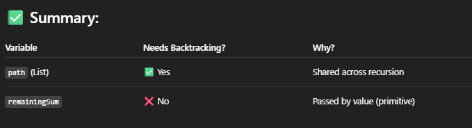
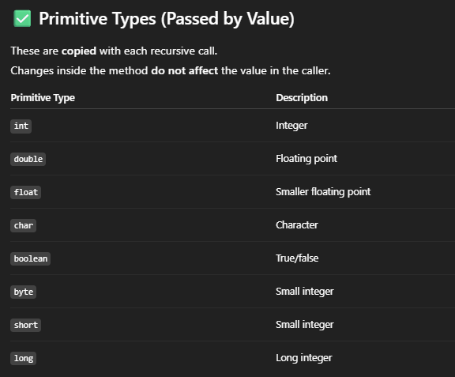
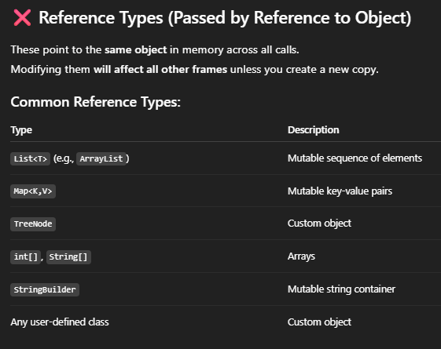

# 113. Path Sum II

## Approach - DFS + backtracking

### 写法一

```java
class Solution {
    public List<List<Integer>> pathSum(TreeNode root, int targetSum) {
        List<List<Integer>> res = new ArrayList<>();
        dfs(root, targetSum, 0L, new ArrayList<>(), res);
        return res;
    }

    private void dfs(TreeNode root, int targetSum, Long curSum, List<Integer> list, List<List<Integer>>res) {
        if (root == null) return;
    
        curSum += root.val;
        list.add(root.val);
        if (curSum == targetSum && root.left == null && root.right == null) {
            res.add(new ArrayList<>(list));
        }
        
        dfs(root.left, targetSum, curSum, list, res);
        dfs(root.right, targetSum, curSum, list, res);
        curSum -= root.val;
        list.remove(list.size()-1);
    }
}
```

- O(N): Visit each node once
- O(H) space for recursion stack, where H = height of the tree

### 写法二
```java
class Solution {
    public List<List<Integer>> pathSum(TreeNode root, int targetSum) {
        List<List<Integer>> res = new ArrayList<>();
        dfs(root, targetSum, new ArrayList<>(), res);
        return res;
    }

    private void dfs(TreeNode root, int remainningSum, List<Integer> list, List<List<Integer>>res) {
        if (root == null) return;
    
        list.add(root.val);
        if (root.left == null && root.right == null && remainningSum == root.val) {
            res.add(new ArrayList<>(list));
        } else {
            dfs(root.left, remainningSum-root.val, list, res);
            dfs(root.right, remainningSum-root.val, list, res);
        }
        
        list.remove(list.size()-1);
    }
}

```

- We do not need to manually add back to remainingSum because integer is a primitive type, which means in each recursive call, it creates its copy of the primitive type and modification of the primitive type wont affect each other. 
- However, if it is a reference type, it will be affected. 
- we dont need to backtrack String as well





