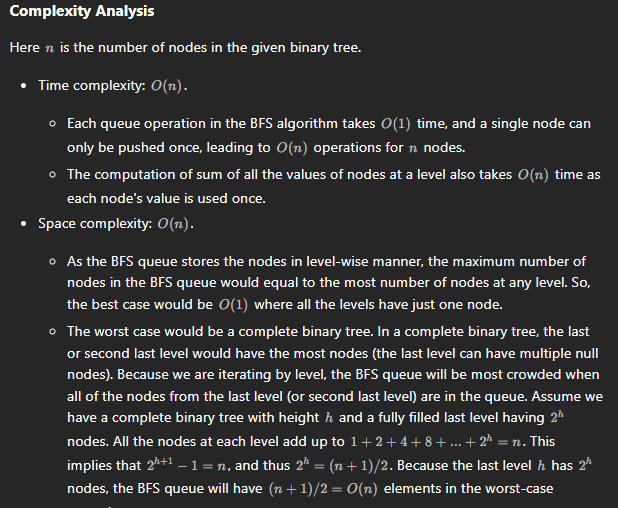
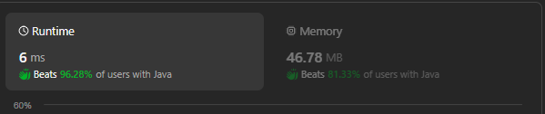
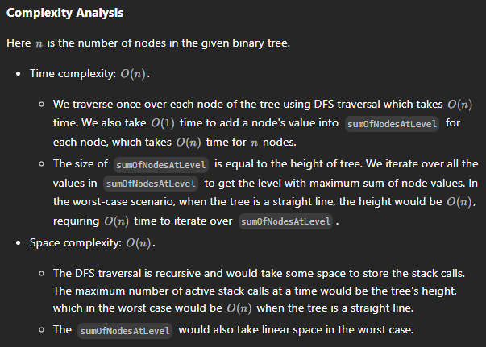

# 1161.  Maximum Level Sum of a Binary Tree

## Approach 1 by Lei - BFS


```java
class Solution {
    public int maxLevelSum(TreeNode root) {
        int maxSum = Integer.MIN_VALUE;
        int level = 0;
        int res = 0;
        Queue<TreeNode> que = new LinkedList<>();

        que.add(root);

        while (!que.isEmpty()) {
            level++;
            int sum = 0;
            int size = que.size();

            for (int i = 0; i < size; i++) {
                TreeNode node = que.poll();
                sum += node.val;

                if (node.left != null) que.add(node.left);
                if (node.right != null) que.add(node.right);
                
            }

            if (sum > maxSum) {
                maxSum = sum;
                res = level;
            }
        }
        return res;
    }
}
```



## Approach 2 - DFS



```java
class Solution {
    public int maxLevelSum(TreeNode root) {
        List<Integer> sumList = new ArrayList<>();
        dfs(root, 0, sumList);
        
        int maxSum = Integer.MIN_VALUE;
        int res = 0;

        for (int i = 0; i < sumList.size(); i++) {
            if (sumList.get(i) > maxSum) {
                maxSum = sumList.get(i);
                res = i+1;
            }
        }
        return res;
    }

    public void dfs(TreeNode node, int level, List<Integer> list) {
        if (node == null) {
            return;
        }

        if (level == list.size()) {
            list.add(node.val);
        } else {
            list.set(level, list.get(level) + node.val);
        }

        dfs(node.left, level+1, list); // or ++level, level++ would be wrong
        dfs(node.right, level+1, list);
    }
}
```

