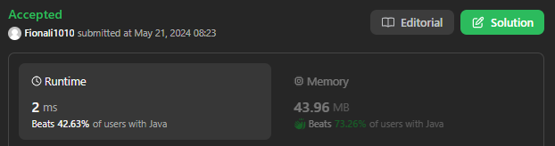
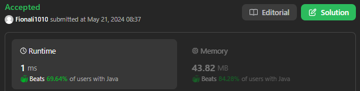

# 117.  Populating Next Right Pointers in Each Node II

## Approach 1 by Lei - two deque

```java
class Solution {
    public Node connect(Node root) {
        if (root == null) {
            return null;
        }

        Deque<Node> cur = new ArrayDeque<>();
        Deque<Node> next = new ArrayDeque<>();

        cur.addLast(root);
        while (!cur.isEmpty()) {
            int size = cur.size();
            for (int i = 0; i < size; i++) {
                Node node = cur.removeFirst();
                if (node.left != null) next.addLast(node.left);
                if (node.right != null) next.addLast(node.right);
                if (!cur.isEmpty()) {
                    node.next = cur.peekFirst();
                }else {
                    node.next = null;
                }
            }

            // Swap cur and next deques
            Deque<Node> temp = cur;
            cur = next;
            next = temp; // we cannot clear next before assign temp to it, otherwise we will clear both next and cur, as cur and next points to the same data; deque is a reference type;
            next.clear(); // Clear the deque for the next level
        }
        return root;
    }
}
```
- Time complexity is O(n) where n is the number of nodes, as each node is processed exactly once.
- Space complexity is O(n) in the worst case due to the use of the deques.

## Approach 2 - one queue



```java 
class Solution {
    public Node connect(Node root) {
        if (root == null) {
            return root;
        }

        // Initialize a queue data structure which contains
        // just the root of the tree
        Queue<Node> Q = new LinkedList<Node>();
        Q.add(root);

        // Outer while loop which iterates over
        // each level
        while (Q.size() > 0) {
            // Note the size of the queue
            int size = Q.size();

            // Iterate over all the nodes on the current level
            for (int i = 0; i < size; i++) {
                // Pop a node from the front of the queue
                Node node = Q.poll();

                // This check is important. We don't want to
                // establish any wrong connections. The queue will
                // contain nodes from 2 levels at most at any
                // point in time. This check ensures we only
                // don't establish next pointers beyond the end
                // of a level
                if (i < size - 1) {
                    node.next = Q.peek();
                }

                // Add the children, if any, to the back of
                // the queue
                if (node.left != null) {
                    Q.add(node.left);
                }
                if (node.right != null) {
                    Q.add(node.right);
                }
            }
        }

        // Since the tree has now been modified, return the root node
        return root;
    }
}
```

## Approach 3 - much improved version (推荐)



```java
class Solution {
    public Node connect(Node root) {
        // corner case
        if (root == null) return null;
        
        Deque<Node> que = new ArrayDeque<>();
        que.offer(root);

       
        while (!que.isEmpty()) {
            int n = que.size();
            Node prev = null;
            
            for (int i = 0; i < n; i++) {
                Node cur = que.poll();
                if (prev != null) prev.next = cur;
                prev = cur;

                if (cur.left != null) que.offer(cur.left);
                if (cur.right != null) que.offer(cur.right);
            }
        }

        return root;
    }
}
```

