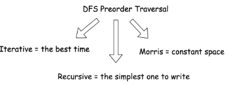
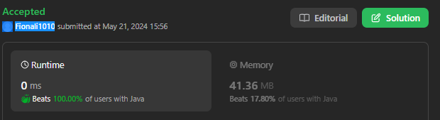

# 129. Sum Root to Leaf Numbers

- Root-to-left traversal is so-called DFS preorder traversal. To implement it, one has to follow a straightforward strategy Root->Left->Right.



## Approach 1 by Lei



```java
class Solution {

    int sumTotal = 0; // if this is defined in sumNumbers, it wont work. has to be global variable

    public int sumNumbers(TreeNode root) {
        if (root == null) {
            return 0;
        }

        List<Integer> path = new ArrayList<>();

        dfs(root, path);

        return sumTotal;
    }

    public void dfs(TreeNode node, List<Integer> path) {
        if (node == null) return;

        path.add(node.val);

        if (node.right == null & node.left == null) {
            for (int i = 0; i < path.size(); i++) {
                sumTotal += path.get(i) * Math.pow(10, path.size()-i-1);
            }
        }

        dfs(node.left, path);
        dfs(node.right, path);

        path.remove(path.size()-1);
    }
}

// another way to do it:
class Solution {
    int rootToLeaf = 0;

    public void preorder(TreeNode r, int currNumber) {
        if (r != null) {
            currNumber = currNumber * 10 + r.val;
            // if it's a leaf, update root-to-leaf sum
            if (r.left == null && r.right == null) {
                rootToLeaf += currNumber;
            }
            preorder(r.left, currNumber);
            preorder(r.right, currNumber);
        }
    }

    public int sumNumbers(TreeNode root) {
        preorder(root, 0);
        return rootToLeaf;
    }
}

// using while
class Solution {
    public int sumNumbers(TreeNode root) {
        int rootToLeaf = 0, currNumber = 0;
        Deque<Pair<TreeNode, Integer>> stack = new ArrayDeque();
        stack.push(new Pair(root, 0));

        while (!stack.isEmpty()) {
            Pair<TreeNode, Integer> p = stack.pop();
            root = p.getKey();
            currNumber = p.getValue();

            if (root != null) {
                currNumber = currNumber * 10 + root.val;
                // if it's a leaf, update root-to-leaf sum
                if (root.left == null && root.right == null) {
                    rootToLeaf += currNumber;
                } else {
                    stack.push(new Pair(root.right, currNumber));
                    stack.push(new Pair(root.left, currNumber));
                }
            }
        }
        return rootToLeaf;
    }
}

```

## Appraoch 2 - 分治法


```java
class Solution {
    public int sumNumbers(TreeNode root) {
        return dfs(root, 0);
    }

    public int dfs(TreeNode node, int currSum) {
        if (node == null) return 0;

        currSum = currSum * 10 + node.val;

        // 每个leaf需要返回的值
        if (node.left == null && node.right == null) {
            return currSum;
        }

        int leftSum = dfs(node.left, currSum);
        int rightSum = dfs(node.right, currSum);

        //leaf往上走需要返回的值，backtracking 经过的点自带的currSum已经没有意义了，关键是每一个点向上一层return的值
        return leftSum + rightSum;
    }
}


```